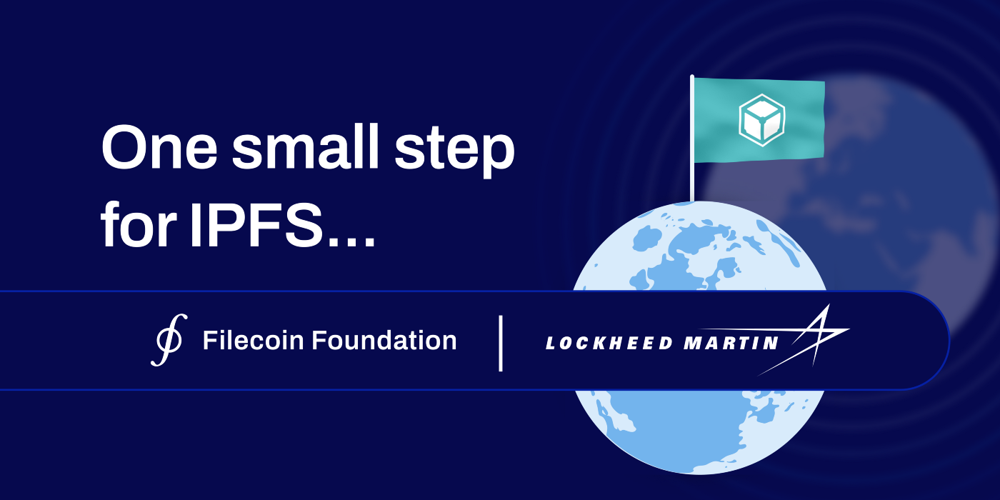

## **IPFS to Launch Into Space**

The Filecoin Foundation [**announced**](https://twitter.com/IPFS/status/1616110027261227009?s=20&t=fv3FslvX-vH59U0lkAn4nw) a first-of-its-kind mission to [**send IPFS into space**](https://fil.org/blog/ff-x-lockheed-martin-mission-announcement/) in 2023. The mission will happen aboard Lockheed Martin’s LM 400 Technology Demonstrator spacecraft, a “software-defined satellite” that is created to support numerous missions. After the spacecraft is in orbit, it will use its “SmartSat™ software-defined satellite technology to upload and perform the IPFS demonstration.” This mission will showcase how IPFS uses content addressing to speed up data transfer across long distances.

## **Brand New on IPFS ✨**

1. New year, new [IPFS Community Calendar](https://blog.ipfs.tech/2023-01-ipfs-community-calendar/)! Subscribe to [the calendar](https://lu.ma/ipfs) to be informed about any new events.
2. [Pin Tweet to IPFS](https://blog.ipfs.tech/announcing-pin-tweet-to-ipfs/) aims to help users archive posts in a verifiable way, publishing to the IPFS network through a pinning service.
3. Learn more about Testground, a [platform for testing](https://blog.ipfs.tech/testground-highlights-in-2022/) and benchmarking distributed systems.
4. IPFS Thing now has a confirmed location: Brussels, Belgium. [Pre-registration](https://lu.ma/ipfsthing-preregistration) is open!

## **Around the Ecosystem 🌎**

The FVM ([Filecoin Virtual Machine](https://filecoin.io/blog/posts/the-filecoin-virtual-machine-explained/)) brings smart contracts and user programmability to the Filecoin blockchain, unlocking the world's largest open-access data economy. Join the Filecoin Community at the EthGlobal FVM Space Warp Hackathon to be one of the first to build on FVM and win over $150K in prizes. [Apply](https://ethglobal.com/events/spacewarp) before the deadline, January 20, 2023 at 11:59PM EST.

For other FVM opportunities check out the [Space Warp](https://spacewarp.fvm.dev/) program! It aims to help the builder community accelerate the development of new value-adding apps on the Filecoin network in preparation for FVM mainnet launch this year.  
  
Learn more about [WebTransport](https://blog.libp2p.io/2022-12-19-libp2p-webtransport/#what-is-webtransport), a new transport protocol and Web API currently under development. It seeks to address several use cases, including browser gaming, live streaming, multimedia applications, and more.

Telnyx worked with the Filecoin team and ecosystem to build [Telnyx Storage](https://filecoin.io/blog/posts/telnyx-builds-innovative-low-cost-object-storage-on-the-filecoin-network/). Telnyx Storage offers low-cost, low-latency file retrieval from a dense network of storage PoPs, with zero egress fees.

NFTStar is building an [integrated and global sports](https://filecoin.io/blog/posts/case-study-why-nftstar-trusts-decentralized-cloud-storage-for-sports-collectibles/) metaverse platform based in Singapore. Its goal is to create a Web3 community that fosters direct connections between sports stars and their fans.

Rolling Stone partnered with The Starling Lab to help investigate alleged war crimes using modern cryptography and Filecoin’s decentralized storage. [Learn more](https://investigation.rollingstone.com/dj-photo-war-crimes-bosnia/) and explore the archive!

The FVM Imaginarium Campaign is putting the spotlight on the teams who are building incredible use cases and introducing new opportunities and concepts on FVM. The first spotlights [Magmo](https://filecoin.io/blog/posts/the-fvm-imaginarium-magmo-brings-state-channels-to-the-filecoin-virtual-machine/), a development studio and research team that’s a part of Consensys Mesh

[Storage.market](https://storage.market/) is now live! Dive into the information hub on data storage products, showing analytics on the storage market and recent news.

Decentralized Science, or DeSci, is a Web3 movement that aims to improve the current flow of science by improving the research funding process, facilitating unrestricted sharing of knowledge and shifting ownership to researchers. [Learn more](https://plnnews.substack.com/p/web3-in-60-desci) at _Web3 in :60_!

[Filecoin Green’s](https://green.filecoin.io/) next meetup kicks off on January 24 at 1 PM ET! [Tune in](https://twitter.com/filecoingreen/status/1616088196944744450) for a special edition carbon offset roundtable.

## Want to help build the new internet? 💼

[**NodeJS developer | FinTech:**](https://www.linkedin.com/jobs/view/nodejs-developer-fintech-at-supermojo-3356945255?refId=8qQPjwNzIDpcuwJDzbSMow%3D%3D&trackingId=i9xHYRlVTS2pJfbq3%2F7S5A%3D%3D&trk=public_jobs_topcard-title) Super Mojo is an embedded finance checkout experience for NFT marketplaces. You will build a distributed financial platform which executes transactions in milliseconds and enables a magical checkout experience for Super Mojo users. You will help with designing and heavily contributing to the product architecture and foundation and work with teams across the organization, including product, legal, and business development to think beyond the technical implications of your design decisions. **Super Mojo**, San Francisco, CA.  
  
[**People Manager, PL Network:**](https://boards.greenhouse.io/protocollabs/jobs/4769907004) Protocol Labs is hiring a People Manager, PL Network. The People Manager, PL Network role is highly versatile and execution oriented. You will have the opportunity to add value to the collective of 200+ PL Network startups around the world, building the future of web3, by managing projects and strategic initiatives that elevate their people practices and programming. **Protocol Labs**, Remote.  
  
[**Project Manager:**](https://the-graph.breezy.hr/p/bfa7fef3dc32-project-manager) The Graph ecosystem continues to grow, and they're looking for a Project Manager to support activities including, but not limited to, governance and internal processes and operations. The Graph is the indexing and query layer of web3. The Graph Network’s self service experience for developers launched in July 2021. Developers build and publish open APIs, called subgraphs, that applications can query using GraphQL. The Graph supports indexing data from multiple different networks including Ethereum, NEAR, Arbitrium, Optimism, Polygon, Avalanche, Celo, Fantom, Moonbeam, IPFS, and PoA with more networks coming soon. To date, tens-of-thousands of subgraphs have been deployed on the hosted service, and now subgraphs can be deployed directly on the network. Over 28,000 developers have built subgraphs for applications such as Uniswap, Synthetix, KnownOrigin, Art Blocks, Balancer, Livepeer, DAOstack, Audius, Decentraland, and many others. **The Graph**, United States.  
  
[**Engineering Manager, Stewards libp2p:**](https://boards.greenhouse.io/protocollabs/jobs/4765047004) Engineers, researchers, and operators work in the open to improve the internet — humanity's most important technology — as we explore new advances at the intersection of many exciting fields (web3, cryptography, networks, distributed systems) and cultures (startups, research, open-source, distributed work). Stewards libp2p sets direction/standards for projects, protocols, and architecture. Cultivate a vibrant contributing community around libp2p! **Protocol Labs**, Remote.