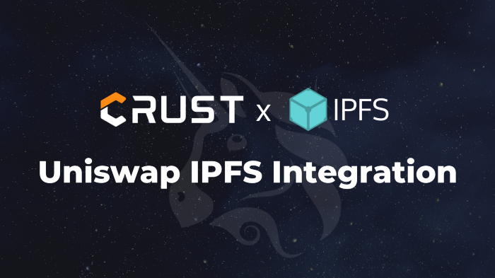

Here’s what’s happening in the [**InterPlanetary File System**](https://ipfs.io/) galaxy!

## Decentralized Uniswap Interface Hosting on IPFS

Uniswap has merged the code to continuously deploy its interface on Crust Network! Hosting a website/DApp frontend on IPFS grants you several benefits, such as serverless hosting, potential resilience to DNS hijacks (together with IPNS/ENS), and high uptime. Uniswap, as one of the most widely used DEX’s (Decentralized Exchange), has been integrated with IPFS for approximately a year. [This article](https://medium.com/crustnetwork/decentralized-uniswap-interface-hosting-on-ipfs-18a78d1209ac) explains the whole process in more detail, and also describes how to host a website in a more decentralized way using Crust.

## Help improve the Filecoin storage network!

The user research team at Protocol Labs is seeking members of the IPFS ecosystem to participate in an hour-long user testing session for the Filecoin storage network between April 19 and April 30. (No prior experience with Filecoin needed!) Participants who are selected and successfully complete these sessions will receive an Amazon gift card valued at $150 USD as compensation for their time. Complete this [short survey](https://airtable.com/shrOEfGSKe1WVALKi?prefill_Study=Filecoin%20storage%20and%20retrieval) to apply!

## Brand new on IPFS

* Palm NFT Studio announces the launch of their first project with Damien Hirst with permanent decentralized storage of NFT metadata on IPFS. [Read more.](https://consensys.net/blog/press-release/palm-a-new-nft-ecosystem-and-studio-for-creators-announces-launch-of-first-project-with-damien-hirst/)
* IPFS now offers announcements, release notes, video tutorials, news coverage and events all in one place! [Check out our new blog.](https://blog.ipfs.io/)
* [Apps are open for the Filecoin Launchpad Accelerator II.](https://t.co/mg4k3PNQ8y?amp=1) For startups building apps for the dweb through IPFS, Filecoin, and Ethereum networks.
* Want to build a no-code NFT file but not sure where to start? Look no further! [Learn how to do it with Zapier and IPFS.](https://medium.com/pinata/build-a-no-code-nft-file-tool-with-zapier-and-ipfs-9bd44a3b23b7)

## Around the ecosystem 🌏

VideoCoin is integrating its decentralized video processing network with Filecoin to build the first platform specifically designed for creating and trading Video NFTs. [Read more.](https://filecoin.io/blog/posts/videocoin-and-filecoin-to-power-the-video-nft-market/)

The Pinata team joined the NonFunGerbils podcast to chat about how IPFS and Pinata work, as well as current and future best practices for NFTs, and more. [Listen.](https://t.co/ig8zG1GQbP?amp=1)

Omni Analytics developed a Filecoin Miner Index API to help enthusiasts get a high-level overview of the health and performance of storage miners. [Learn more.](https://t.co/JdwItOWl4T?amp=1)

Want to catch up on crypto pop culture news? Check out the podcast and video series Pop Crypto Recap by Unstoppable Domains. [Watch.](https://t.co/LN88co720P?amp=1)

Cloudflare is running a series of developer challenges to play with some of their new features. [Join the fun.](https://t.co/Zrbg89xd2E?amp=1)

## Upcoming 📅

The April IPFS meetup will be an opportunity to showcase what the community has been building with NFTs! [Sign up here](https://protocollabs.typeform.com/to/hLGfKhxn) to present, or [register to attend](https://www.meetup.com/San-Francisco-IPFS/events/276123324/) on April 27th and be prepared to learn more about the world of IPFS x NFTs!

## Want to help build the new internet?

[Chief of Staff](https://jobs.lever.co/protocol/dc3ca53d-b456-4f91-806d-4ec6b5821dc5): As Chief of Staff, you’ll play a key role enabling and supporting our CEO. The Chief of Staff will have an impact on the efficiency and productivity of the company, streamlining business initiatives, driving program management and communicating cross functional objectives. **Protocol Labs**, Remote.

[Software Engineers](https://jobs.lever.co/protocol): Seeking seasoned software engineers with specializations in cryptography and systems, distributed systems, and peer-to-peer networks to help shape the next generation of network protocols. **Protocol Labs**, Remote.

[Research Scientists](https://jobs.lever.co/protocol): Seeking research scientists in the following areas: cryptography, distributed systems, networking, independent research. **Protocol Labs**, Remote.

[Senior Full Stack Engineer](https://textile.breezy.hr/p/d59ca1308346-senior-full-stack-engineer): This role is for someone with solid coding experience who likes to experiment, design, and learn new things. We are looking to fill this position soon. We are looking for someone who can rapidly scope and build new web applications and work with APIs and backend services. **Textile**, Remote.

[Senior Go Engineer](https://textile.breezy.hr/p/421d4f71a227-senior-go-engineer): As a Senior Go Engineer, you will be responsible for writing and maintaining code on the Textile Go libraries, including [Threads](https://github.com/textileio/go-threads), [Buckets](https://github.com/textileio/go-buckets), [Hub](https://github.com/textileio/textile), and [Powergate](https://github.com/textileio/powergate). This role is for someone with solid coding experience and the ability to lead new features. **Textile**, Remote.

[Consensus Protocol and DLT Engineer](https://angel.co/company/humanode-2/jobs/1265884-consensus-protocol-and-dlt-engineer):  Consensus is looking for a Lead Engineer with solid experience in building or working with consensus mechanisms such as Snow family, Clique, Aura, pBFT. Knowledge and experience with Ethereum, EVM and Smart Contracts is crucial as EVM-compatibility is key in the market. **Consensus**, Humanode, Remote.

**IPFS strives to make the web faster, safer, and more open.**

Get involved with IPFS by checking us out on [GitHub](https://github.com/ipfs), joining discussions on [our community forum](https://discuss.ipfs.io/), or hitting us up [in chat](https://riot.im/app/#/room/#ipfs:matrix.org). Have a suggestion? [Email us](mailto:newsletter@ipfs.io).

Get the IPFS Weekly in your inbox, each Tuesday. [**Sign up now.**](https://ipfs.us4.list-manage.com/subscribe?u=25473244c7d18b897f5a1ff6b&id=cad54b2230)