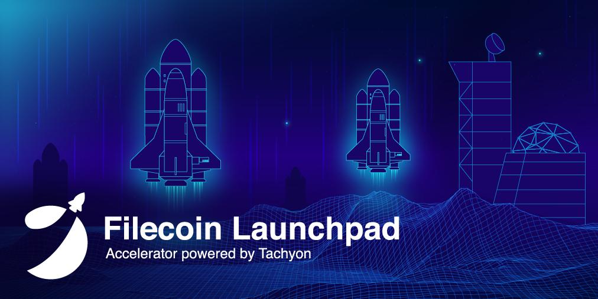

Here’s what’s happening in the [**InterPlanetary File System**](https://ipfs.io/) galaxy!

## Deploying Web3: IPFS Architecture, Topologies, and Menageries

@[youtube](13rHbWCYNWA)

Last week at Scaling Ethereum, Dietrich Ayala helped kick off the hackathon by presenting a talk on how IPFS is being used to scale Ethereum, the problems IPFS addresses, an introduction to the web3 stack, as well as a quick walkthrough of approaches and resources to use IPFS today. In case you missed the talk, [**catch up here**](https://www.youtube.com/watch?v=13rHbWCYNWA) and be sure to check out our [**recent blog post**](https://blog.ipfs.io/2021-04-14-scaling-ethereum/) that highlights where you can find us at Scaling Ethereum, the prizes that Protocol Labs is offering, as well as some videos that will help you get started.

## Filecoin Launchpad Accelerator II - Apply now!

The Filecoin Launchpad Accelerator is a full-time, fully remote program dedicated to startups building more open, interoperable, and programmable tools, infrastructure, and applications for the distributed and decentralized web. Tachyon supports projects that build on and bridge the [**IPFS**](https://ipfs.io/), [**Filecoin**](https://filecoin.io/), and [**Ethereum**](https://ethereum.org/) communities and the tools, middleware, and applications. The next cohort will run June through August 2021, with 20 teams from around the globe provided funding, mentorship, benefits, and programming around business and blockchain-specific issues, culminating in a Demo Day and post-program fundraising support kicking off in September. [Applications are now open and close at midnight EST on May 9.](https://tachyon.submittable.com/submit/192229/filecoin-launchpad-accelerator-ii)

## Brand new on IPFS

* [Fleek released a new video](https://www.youtube.com/watch?v=Kddvfs8u9bQ) introducing Handshake by showing how to pair your HNS decentralized domains with IPFS.
* Coywolf’s team recently tested IPFS and loved it! [Read their full report](https://www.coywolf.news/webmaster/ipfs/).
* IPFS Web UI just released v2.12.0 with built-in support for remote pinning services! [Check out the release notes](https://github.com/ipfs/ipfs-webui/releases/tag/v2.12.0) for all updates, the changelog, and more.
* Buying an NFT? Check out [this guide ](https://blog.indorse.io/buying-an-nft-things-you-need-to-know-e4f73adb8572)by Indorse that highlights all you need to know, with a special IPFS feature.

## Around the ecosystem 🌏

Fission is working on adding an IPFS bitswap monitoring into their front end systems. Check out [**their post**](https://talk.fission.codes/t/ipfs-bitswap-monitoring/1830) for more info.

Gamedev.js Jam celebrates HTML5 games and is happening now through April 26th at 5PM CET. Build a Web game on a given theme and [**win prizes**](https://gamedevjs.com/jam/2021/)!

If you’re building something on Uniswap, make sure to [**submit for their current Grants Round**](https://airtable.com/shrEXXxXB1humz7VS) by May 31. 

Digital MOB has launched the first version of their Filecoin Miner Reputation System. [**Learn more**](https://filecoin.io/blog/posts/filrep.io-a-filecoin-miner-reputation-system-v1-by-digital-mob/).

Protocol Labs is staking $7500 in prizes at the Scaling Ethereum Hackathon with ETHGlobal, happening now! [**Learn more and start building**](https://blog.ipfs.io/2021-04-14-scaling-ethereum/). 

It’s Digital Transformation Week and our friends at Cloudflare are hosting a content and networking event to celebrate. [**Register here**](https://digitaltransformation-week.com/home/digital-transformation-week-registration/).

Longhash Ventures is hosting the Filecoin Frontier Demo Day on Friday, April 23rd, at 9am (GMT +8). [**RSVP!**](https://docs.google.com/forms/d/e/1FAIpQLScn_Ix2MkTiZEkRbxcFrewLWXGCYxV2Xy8-FcnxXVkACFQwPQ/viewform)

## Upcoming 📅

The April IPFS meetup will be an opportunity to showcase what the community has been building with NFTs! [Sign up here](https://protocollabs.typeform.com/to/hLGfKhxn) to present, or [register to attend](https://www.meetup.com/San-Francisco-IPFS/events/276123324/) on April 27th and be prepared to learn more about the world of IPFS x NFTs!

## Want to help build the new internet?

[**Chief of Staff**](https://jobs.lever.co/protocol/dc3ca53d-b456-4f91-806d-4ec6b5821dc5): As Chief of Staff, you’ll play a key role enabling and supporting our CEO. The Chief of Staff will have an impact on the efficiency and productivity of the company, streamlining business initiatives, driving program management and communicating cross functional objectives. **Protocol Labs,** Remote.  
  
[**Research Scientists**](https://jobs.lever.co/protocol): Seeking research scientists in the following areas: cryptography, distributed systems, networking, independent research. **Protocol Labs**, Remote.   
  
[**Software Engineers**](https://jobs.lever.co/protocol): Seeking seasoned software engineers with specializations in cryptography and systems, distributed systems, and peer-to-peer networks to help shape the next generation of network protocols. **Filecoin, IPFS, lib2p2**, Remote.  
  
[**Senior Full Stack Engineer**](https://textile.breezy.hr/p/d59ca1308346-senior-full-stack-engineer): This role is for someone with solid coding experience who likes to experiment, design, and learn new things. We are looking to fill this position soon. We are looking for someone who can rapidly scope and build new web applications and work with APIs and backend services. **Textile**, Remote.  
  
[**Senior Go Engineer**](https://textile.breezy.hr/p/421d4f71a227-senior-go-engineer): As a Senior Go Engineer, you will be responsible for writing and maintaining code on the Textile Go libraries, including [**Threads**](https://github.com/textileio/go-threads), [**Buckets**](https://github.com/textileio/go-buckets), [**Hub**](https://github.com/textileio/textile), and [**Powergate**](https://github.com/textileio/powergate). This role is for someone with solid coding experience and the ability to lead new features. **Textile**, Remote.  
  
[**Consensus Protocol and DLT Engineer:**](https://angel.co/company/humanode-2/jobs/1265884-consensus-protocol-and-dlt-engineer) Consensus is looking for a Lead Engineer with solid experience in building or working with consensus mechanisms such as Snow family, Clique, Aura, pBFT. Knowledge and experience with Ethereum, EVM and Smart Contracts is crucial as EVM-compatibility is key in the market. **Consensus**, **Humanode**, Remote.

Get the IPFS Weekly in your inbox, each Tuesday. [**Sign up now.**](https://ipfs.us4.list-manage.com/subscribe?u=25473244c7d18b897f5a1ff6b&id=cad54b2230)