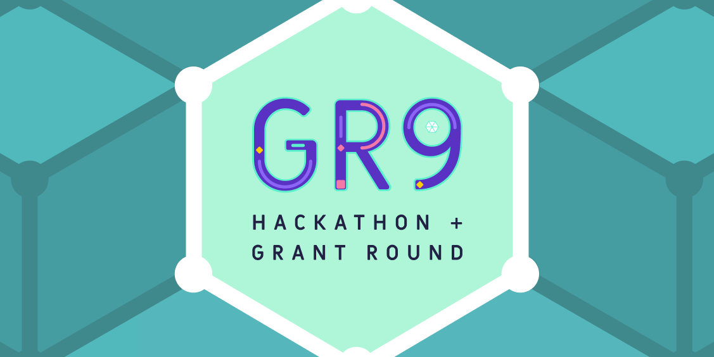

Here’s what’s happening in the [**InterPlanetary File System**](https://ipfs.io/) galaxy!

## Audius Uses IPFS for Content Streaming Storage to Empower Artists & Creators Worldwide

@[youtube](c50licHTOik)

The IPFS community is proud to share another video in the [**Building Web3 Video Series**](https://buildingweb3.com/), which is dedicated to technologists, teams, and visionaries who are building valuable tools and services for a Web3 world. The latest video features [**Audius**](https://audius.org/), a music and audio sharing platform that uses IPFS as the core decentralized storage component in their mission to give everyone the freedom to share, monetize and listen to any audio. [**Read our recent blog post to learn more about the IPFS and Audius collaboration.**](https://blog.ipfs.io/2021-05-05-audius-uses-ipfs-web3-video/)

## Congrats, Gitcoin Grants Round 9 winners!

For the Gitcoin GR9 Hackathon, Protocol Labs matched 100% of [**Textile**](https://blog.textile.io/funding-the-community/) and [**Fleek’s**](https://blog.fleek.co/posts/gitcoin-gr9-hackathon-fleek-winners) bounties in effort to amplify the ability of our ecosystem collaborators to be stewards of the IPFS/Filecoin ecosystem and decentralize growth and development. Moreover, $23k in bounties for Filecoin and IPFS were offered to encourage the best of the best for tools, libraries, APIs, apps, integrations, and more.

Winners were selected from 167 projects total, with 36 submissions to our ecosystem bounties, [**read this post to learn all about the winning projects - congratulations!**](https://blog.ipfs.io/2021-05-10-gitcoin-gr9-recap/)

## Brand new on IPFS

* Looking to build your next project or business on IPFS? [**Apply for a DoraHacks grant**](https://hackerlink.io/en/Grant/Filecoin/Round/1/buidl).
* Mark your calendars for the monthly IPFS meetup on 05/25 at 10AM PT! [**Register to speak or join.**](https://www.meetup.com/San-Francisco-IPFS/events/276123403/)
* Pinata released dedicated IPFS gateways so NFTs and DeFi dapps both have a fast, branded way to serve content! [**Learn more.**](https://medium.com/pinata/announcing-dedicated-ipfs-gateways-60f599949ce)
* IPFS Desktop v0.15.0 has been released and it features IPFS webui v2.12 and electron 12.x.   
  [**Get the details**](https://github.com/ipfs/ipfs-desktop/releases/tag/v0.15.0).

## Around the ecosystem 🌏

SpaceX and Elon Musk are using IPFS for all of their interplanetary storage needs in Saturday Night Live’s skit from last week! [**Watch now.**](https://youtu.be/FuaDWyCnJxs)

Creating NFTs? Learn how to “Get NFTs Right” on [**VideoCoin’s blog.**](https://medium.com/videocoin/how-to-get-nfts-right-architecture-and-roadmap-part-1-fcc7bd589391)

Kotal v0.1-alpha.3 has been released with support for IPFS peers, swarm, and cluster peers! [**Read all about it.**](https://t.co/2zGjtbKHuk?amp=1)

DFinity premiered their “Genesis Launch Event” with speakers from Fleek and others last week. [**Watch.**](https://www.youtube.com/watch?v=xiupEw4MfxY&t=2s)

Looking for a full NFT reading list? The DWeb team created [**this great resource to get started.**](https://docs.google.com/document/d/1425Y5mVr1Ky_FnpjKx5fMPyjipOEppeOJTdncFvrSuo/edit)

Scaling Ethereum ends this week! Make sure to [**submit your projects**](https://scaling.ethglobal.co/) for your chance at prizes from IPFS, Filecoin, and others.

Looking for free NFT storage? [**Learn about Protocol Labs’ NFT.Storage in CryptoNinjas.**](https://www.cryptoninjas.net/2021/04/29/built-on-filecoin-and-ipfs-nft-storage-offers-free-protection-for-nft-asset-data/)

## Want to help build the new internet?

[**Backend/Platform Engineer:**](https://jobs.lever.co/3box) 3Box Labs is looking for a Backend Engineer who will build key infrastructure components and support reliable deployments for us and the community. **3Box Labs**, Remote.

[**Protocol Engineer:**](https://jobs.lever.co/3box) 3Box Labs is looking for a Protocol Engineer to extend the security, privacy, functionality, and performance of the Ceramic Protocol. **3Box Labs**, Remote.

[**Multiple Positions Open**](https://jobs.lever.co/protocol): Protocol Labs has updated their job board with openings across positions in Administration, Business Development, Business Operations, Communications, Community, Engineering, Finance, Legal, Talent, Product, Project Management, Research, & Security. **Protocol Labs, Filecoin, IPFS**, Remote.

[**Software Engineers**](https://jobs.lever.co/protocol): Seeking seasoned software engineers with specializations in cryptography and systems, distributed systems, and peer-to-peer networks to help shape the next generation of network protocols. **Filecoin, IPFS, lib2p2**, Remote.

[**Senior Full Stack Engineer**](https://textile.breezy.hr/p/d59ca1308346-senior-full-stack-engineer): This role is for someone with solid coding experience who likes to experiment, design, and learn new things. We are looking to fill this position soon. We are looking for someone who can rapidly scope and build new web applications and work with APIs and backend services. **Textile**, Remote.

[**Senior Go Engineer**](https://textile.breezy.hr/p/421d4f71a227-senior-go-engineer): As a Senior Go Engineer, you will be responsible for writing and maintaining code on the Textile Go libraries, including[**Threads**](https://github.com/textileio/go-threads),[**Buckets**](https://github.com/textileio/go-buckets),[**Hub**](https://github.com/textileio/textile), and[**Powergate**](https://github.com/textileio/powergate). This role is for someone with solid coding experience and the ability to lead new features.**Textile**, Remote.

Get the IPFS Weekly in your inbox, each Tuesday. [**Sign up now.**](https://ipfs.us4.list-manage.com/subscribe?u=25473244c7d18b897f5a1ff6b&id=cad54b2230)