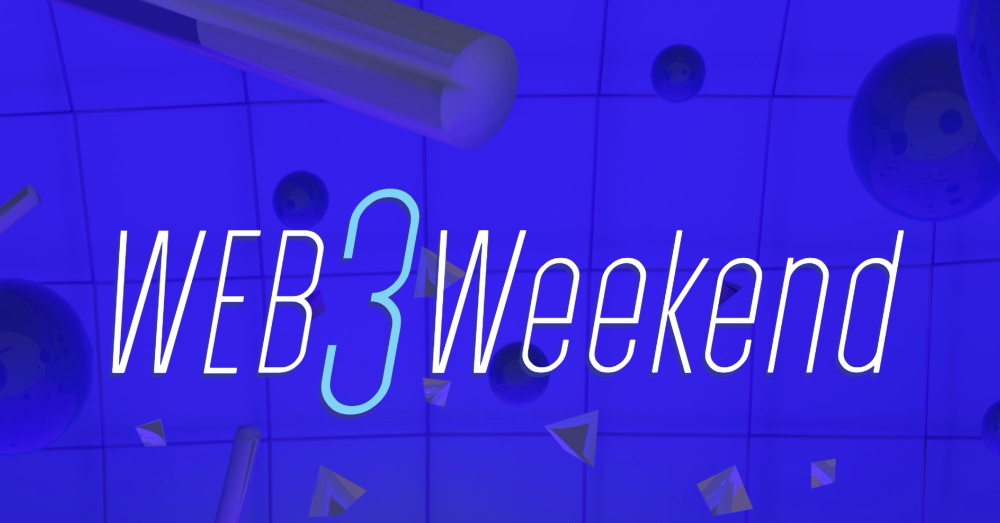
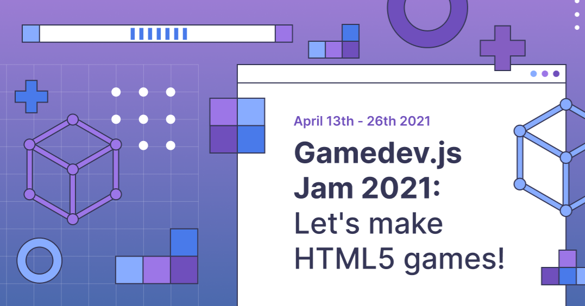

Here’s what’s happening in the [**InterPlanetary File System**](https://ipfs.io/) galaxy!

## ETHGlobal’s Web3 Weekend Starts This Friday, May 28

We're excited to be supporting [**Web3 Weekend**](https://web3.ethglobal.co/), a hackathon focused entirely on the decentralized future. From May 28th - May 30th, hackers from across the globe will gather online to experiment with NFTs, Smart Contracts, Games, and other innovative solutions. If you're interested in hacking, it's not too late! [**Applications are open**](https://web3.ethglobal.co/) — but spots are running out fast, so apply now!

## Decentralized games at Gamedev.js JAM 2021

Earlier this spring, we were happy to partner with the folks at [**Gamedev.js**](https://gamedevjs.com/jam/2021/) for their 2021 hackathon event focused exclusively on games! Gamedev.js Jam celebrates HTML5 games where participants build a web game within 13 days of the jam on a given theme; this year’s was Mirrors.  
  
The IPFS and Filecoin projects put up $5000 in Filecoin into the prize pool for the Decentralization category. As it was the first time the event hosted this category, the community of game developers were seeing some of these technologies for the very first time. Popular tools used were [**Fleek.co**](http://fleek.co/) and Pinata for hosting of assets and data. [**Check out this blog post**](https://blog.ipfs.io/2021-05-20-gamedevjs-recap/) to learn more about the event and about the prize winners.

## Brand new on IPFS

* On 06/21, IPFS will host a workshop with ifip on decentralizing the internet with sessions on VPNs, p2p networks, & more. [**Register here!**](https://networking.ifip.org/2021/registration)
* Learn how IPFS is a secure solution for NFT storage that will protect your metadata permanently [**in this new post with Rarible**](https://rarible.medium.com/meet-metadata-guardians-trying-to-make-your-nft-collection-available-100-years-from-now-60a18baeed6c).
* The May IPFS Meetup happened yesterday, [**catch up on the recording!**](https://www.youtube.com/watch?v=0V1iULVA3GU)
* District0x released a new education portal about IPFS. [**Check it out!**](https://education.district0x.io/district0x-specific-topics/understanding-technology-behind-district0x/ipfs/)

## Around the ecosystem 🌏

Learn how to build Layer 2 NFTs with Polygon and IPFS to maximize and streamline your NFT’s efficiency. [**Read Pinata’s blog**](https://medium.com/pinata/how-to-create-layer-2-nfts-with-polygon-and-ipfs-aef998ff8ef2).  
  
The Lighthouse Project provides a way for Ethereum smart contracts to request Filecoin storage of CIDs in IPFS via Textileio’s Powergate. [**Learn how to use it & run your own Lighthouse node.**](https://nanditmehra123.medium.com/lighthouse-filecoin-ethereum-cross-chain-infra-project-66c041a1a1db)  
  
Polkadot Decoded recently shared an interesting video on building Smart Cities with Web3. [**Check it out!**](https://www.youtube.com/watch?v=B-5OR-zKmLU)  
  
Ceramic’s latest community call discussed protocol upgrades, community updates, and their path to mainnet. [**Tune in.**](https://blog.ceramic.network/community-call-5-07-21/)   
  
The Filecoin Network crossed the sustainability target for the first time recently. [**Get the details**](https://filecoin.io/blog/posts/filecoin-network-crosses-baseline-sustainability-target-for-first-time/).

## Want to help build the new internet?

[**Senior Backend Engineer**](https://pinata.cloud/careers#2): Pinata is looking for a Backend Engineer knowledgeable in NodeJS to help build the future of our platform. As a dedicated Backend Engineer, you will work directly with our CTO and engineering team to build products and features that accelerate our traction. They need somebody that’s experienced with building NodeJS based APIs and working with relational databases. Experience with file storing technologies is a big plus for this position. **Pinata**, Remote.

[**DevOps**](https://pinata.cloud/careers#1): Pinata is looking for somebody with a background in dev-ops to ensure everything runs smoothly as we scale into the future. As the first dedicated DevOps engineer, you will play a key role in helping Pinata design and build a world-class dev ops pipeline. They need somebody who knows how to create systems that monitor their infrastructure and help deploy new updates in an automated fashion. **Pinata**, Remote  
  
[**Backend/Platform Engineer:**](https://jobs.lever.co/3box) 3Box Labs is looking for a Backend Engineer who will build key infrastructure components and support reliable deployments for us and the community. **3Box Labs**, Remote.  
  
[**Protocol Engineer:**](https://jobs.lever.co/3box) 3Box Labs is looking for a Protocol Engineer to extend the security, privacy, functionality, and performance of the Ceramic Protocol. **3Box Labs**, Remote.  
  
[**Multiple Positions Open**](https://jobs.lever.co/protocol): Protocol Labs has updated their job board with openings across positions in Administration, Business Development, Business Operations, Communications, Community, Engineering, Finance, Legal, Talent, Product, Project Management, Research, & Security. **Protocol Labs, Filecoin, IPFS**. Remote.  
  
[**Software Engineers**](https://jobs.lever.co/protocol): Seeking seasoned software engineers with specializations in cryptography and systems, distributed systems, and peer-to-peer networks to help shape the next generation of network protocols. **Filecoin, IPFS, lib2p2**, Remote.  
  
[**Senior Full Stack Engineer**](https://boards.greenhouse.io/textileio/jobs/4017984004): This role is for someone with solid coding experience who likes to experiment, design, and learn new things. We are looking to fill this position soon. We are looking for someone who can rapidly scope and build new web applications and work with APIs and backend services. **Textile**, Remote.  
  
[**Backend/API Engineer**](https://boards.greenhouse.io/textileio/jobs/4017981004): As a Backend/API Engineer, you will research, contribute to the product vision and help define the roadmap of multiple products. You will build and maintain features on the [**Textile Hub**](https://github.com/textileio/textile), and build new services and systems to integrate with blockchain networks including [**Threads**](https://github.com/textileio/go-threads), [**Buckets**](https://github.com/textileio/go-buckets), [**Hub**](https://github.com/textileio/textile), and [**Powergate**](https://github.com/textileio/powergate). This role is for someone with solid coding experience and the ability to lead new features. **Textile**, Remote.

Get the IPFS Weekly in your inbox, each Tuesday. [**Sign up now.**](https://ipfs.us4.list-manage.com/subscribe?u=25473244c7d18b897f5a1ff6b&id=cad54b2230)