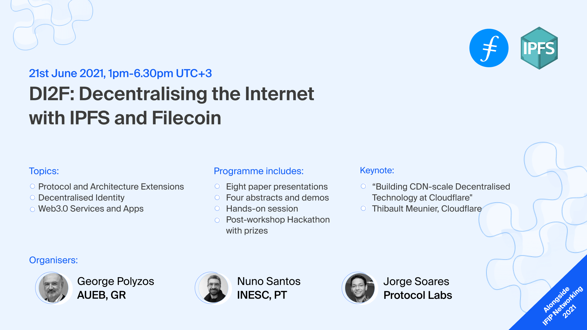

Here’s what’s happening in the [**InterPlanetary File System**](https://ipfs.io/) galaxy!

## IPFS, Filecoin, and Content Persistence

There are two fundamental problems facing the sustainability of content on the internet: addressing and persistence. _Addressing_ refers to the way in which internet users can find the content that they’re looking for online. Today, the Web leans into location addressing, or finding content by where it is located, as opposed to content addressing, which allows network participants to confidently and consistently ensure their content does not change over time without a clear record of that change. _Persistence_ refers to the ability of those network participants to continue accessing content in perpetuity, without worries of the content disappearing or becoming unavailable for any reason. [**Learn more in our recent blog post.**](https://blog.ipfs.io/2021-06-03-ipfs-filecoin-content-persistence/)

## DI2F: Decentralizing the Internet with IPFS and Filecoin

The first edition of a research-focused workshop on decentralisation, IPFS and Filecoin is here! DI2F is taking place alongside IFIP Networking 2021 on June 21, 2021 and it has a packed program full of exciting paper presentations, demos, abstracts, hands-on tutorials and invited talks! The workshop sessions will focus on protocol and architecture extensions, Decentralized Identity and Web 3.0 services.

The workshop’s hands-on session will get the audience kickstarted with the IPFS essentials and a hackathon will kick off at the end of the day and run for the following three weeks, netting the finalists prizes of more than $1,000.

The workshop will run from 13:00-18:30pm UTC+3 on June 21st. You can find the workshop program [**here**](https://networking.ifip.org/2021/workshops/di2f-decentralising-the-internet-with-ipfs-and-filecoin) and registristration for the conference and workshop [**here**](https://networking.ifip.org/2021/registration). Note that non-author students can attend for free but still need to register.

## Brand new on IPFS

* Distributed Wikipedia Mirror & Kiwix projects announced updated English and Turkish mirrors, along with new languages of Arabic, Chinese, Myanmar, & Russian! [**Check it out.**](https://blog.ipfs.io/2021-05-31-distributed-wikipedia-mirror-update/)
* Protocol Labs Ecosystem Lead, Colin Evran, was interviewed on Blockworks’ Base Layer Podcast. [**Tune in**](https://podcasts.apple.com/us/podcast/base-layer-episode-211-colin-evran-from-protocol-labs/id1445373535?i=1000524502274) to learn about IPFS & decentralized storage in Web3.
* [**Check out the highlights from Web3 Weekend**](https://blog.ipfs.io/2021-06-08-web3-weekend/), from workshops to project finalists, and more!
* The next IPFS meetup is Friday, June 22 at 9am PT/5pm UTC. [**Join us for a series of lightning talks**](https://www.meetup.com/en-AU/San-Francisco-IPFS/events/cbjsgsyccjbdc/)!

## Around the ecosystem 🌏

VideoCoin, which uses IPFS and Filecoin, was featured in Forbes’ latest NFT piece on movies and streaming. [**Read it**](https://www.forbes.com/sites/lawrencewintermeyer/2021/06/01/are-movies-and-streaming-the-next-frontier-for-nfts/?sh=23e0495c2b13).   
  
Textile CI Buckets are now on Gitlab! [**Learn more.**](https://gitlab.com/txlab/textile-ci-docker-image)  
  
Pinata recently published the article “Why You Should Stop Sharing Your Creative Work Through Dropbox.” [**Dive in.**](https://medium.com/pinata/why-you-should-stop-sharing-your-creative-work-through-dropbox-7ec38be7da75)  
  
Cloudflare is hosting Cloudflare Connect 2021 this week, an event focused on product leaders. [**Register now to secure your spot**](https://www.cloudflare.com/cloudflare-connect-2021/).  
  
The Filecoin Hyperdrive update is coming! Tune into the AMA on Tuesday, June 8 at 9PM ET to ask your questions [**here**](https://app.sli.do/event/ggm7xqpx).   
  
Couldn’t make it to the Web3 Weekend hackathon with ETHGlobal live? Check out all of the content from the event [**on YouTube**](https://www.youtube.com/watch?v=5CPUSPUGOZ0&list=PL_0VrY55uV1_MGf3-oQ2jmZt4VFQSjenh)!

## Want to help build the new internet?

[**Backend/API Engineer**](https://boards.greenhouse.io/textileio/jobs/4017981004): As a Backend/API Engineer, you will research, contribute to the product vision and help define the roadmap of multiple products. You will build and maintain features on the [**Textile Hub**](https://github.com/textileio/textile), and build new services and systems to integrate with blockchain networks including [**Threads**](https://github.com/textileio/go-threads), [**Buckets**](https://github.com/textileio/go-buckets), [**Hub**](https://github.com/textileio/textile), and [**Powergate**](https://github.com/textileio/powergate). This role is for someone with solid coding experience and the ability to lead new features. Textile, Remote.  
  
[**Full Stack Engineer**](https://boards.greenhouse.io/textileio/jobs/4017984004): This role is for someone with solid coding experience who likes to experiment, design, and learn new things. We are looking to fill this position soon. We are looking for someone who can rapidly scope and build new web applications and work with APIs and backend services. Textile, Remote.  
  
[**Senior Backend Engineer**](https://pinata.cloud/careers#2): Pinata is looking for a Backend Engineer knowledgeable in NodeJS to help build the future of our platform. As a dedicated Backend Engineer, you will work directly with our CTO and engineering team to build products and features that accelerate our traction. They need somebody that’s experienced with building NodeJS based APIs and working with relational databases. Experience with file storing technologies is a big plus for this position. Pinata, Remote.  
  
[**DevOps**](https://pinata.cloud/careers#1): Pinata is looking for somebody with a background in dev-ops to ensure everything runs smoothly as we scale into the future. As the first dedicated DevOps engineer, you will play a key role in helping Pinata design and build a world-class dev ops pipeline. They need somebody who knows how to create systems that monitor their infrastructure and help deploy new updates in an automated fashion. Pinata, Remote.  
  
[**Backend/Platform Engineer:**](https://jobs.lever.co/3box) 3Box Labs is looking for a Backend Engineer who will build key infrastructure components and support reliable deployments for us and the community. 3Box Labs, Remote.  
  
[**Protocol Engineer:**](https://jobs.lever.co/3box) 3Box Labs is looking for a Protocol Engineer to extend the security, privacy, functionality, and performance of the Ceramic Protocol. 3Box Labs, Remote.  
  
[**Multiple Positions Open**](https://jobs.lever.co/protocol): Protocol Labs has updated their job board with openings across positions in Administration, Business Development, Business Operations, Communications, Community, Engineering, Finance, Legal, Talent, Product, Project Management, Research, & Security. Protocol Labs, Filecoin, IPFS. Remote.  
  
[**Software Engineers**](https://jobs.lever.co/protocol): Seeking seasoned software engineers with specializations in cryptography and systems, distributed systems, and peer-to-peer networks to help shape the next generation of network protocols. Filecoin, IPFS, lib2p2, Remote.

Get the IPFS Weekly in your inbox, each Tuesday. [**Sign up now.**](https://ipfs.us4.list-manage.com/subscribe?u=25473244c7d18b897f5a1ff6b&id=cad54b2230)