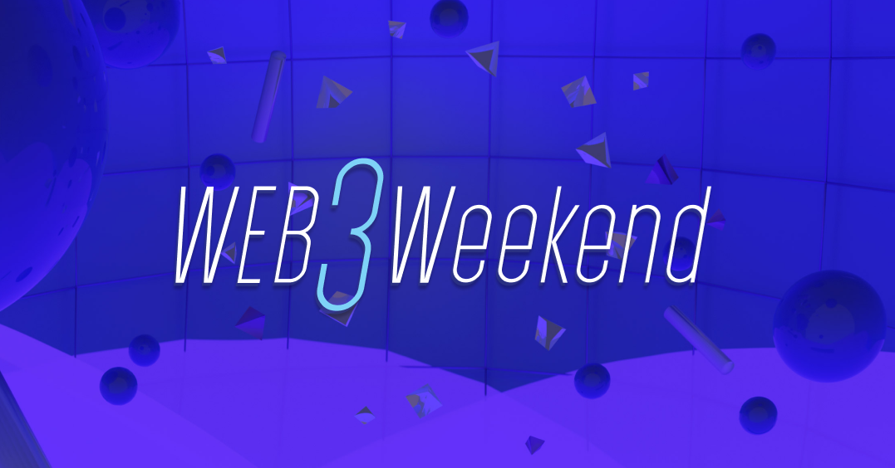

Here’s what’s happening in the [**InterPlanetary File System**](https://ipfs.io/) galaxy!

## Starling Lab: Establishing Trust for Humanity’s Data

Announcing the launch of Starling Lab, a commitment to continue building the frameworks required to endow humanity’s most vital digital information with trust. In collaboration with the USC Shoah Foundation and Stanford University, Starling Lab is deploying technology and methods that make the decentralized internet a viable platform for social impact. With an initial commitment of $2 million in funding from Protocol Labs and the Filecoin Foundation for the Decentralized Web, the Starling Lab is the first center in the world dedicated to using decentralized tools to advance human rights.

Core to the Starling Lab solution is the Starling Framework, a set of open-source prototypes, best practices, and case studies built upon IPFS and Filecoin that help to reduce information uncertainty in digital media. The Starling Framework rests on the fundamental need to capture, store, and verify information to protect its integrity. Read more about Starling Lab [**here**](https://filecoin.io/blog/posts/starling-lab-establishing-trust-for-humanity-s-data/).

## Web3 Weekend in Review

What better way to dive into all things Web3 than a weekend hackathon? The folks at ETHGlobal thought so, and we joined them during the last weekend in May for [**Web3 Weekend**](https://web3.ethglobal.co/).

This three-day event kicked off with a full-day summit, bringing together experts and luminaries from across the ecosystem to encourage and inspire builders to challenge the idea of what’s possible with decentralized technologies. Over the weekend, we offered a combined $20,000 Filecoin (FIL) prize pool distributed evenly between all submissions built on or with IPFS or Filecoin during Web3 Weekend. Any project built with ecosystem tools like Textile, Pinata, Fleek, Ceramic, Fission, Livepeer, and more received a prize—over 65 finalists in total! [**Check out this post**](https://blog.ipfs.io/2021-06-08-web3-weekend/) for a full recap including challenges and finalists, as well as Protocol Labs’ talks and workshops from the event.

## Brand new on IPFS

* [**Snapshot Labs**](https://snapshot.org/#/) is revolutionizing the world of decentralized governance with IPFS by enabling their users to shape their company's project decisions for free. [**Read Decrypt’s article.**](https://decrypt.co/resources/what-is-snapshot-the-decentralized-voting-system)
* [**Berty Alpha**](https://berty.tech/), the privacy-first messaging app built on IPFS and libp2p, is now available on iOS! Join their [**Discord**](https://discord.com/invite/mVfsEUmgSf)to get all the info to download the alpha.
* [**XSL Labs**](https://www.xsl-labs.io/en/) recently published a new educational video introducing IPFS. [**Watch it here**](https://www.youtube.com/watch?v=94HH5D23WWI).
* Have questions about getting started with using `js-ipfs` in your web browser? [**Check out this post**](https://blog.ipfs.io/2021-06-10-guide-to-ipfs-connectivity-in-browsers/).

## Around the ecosystem 🌏

Join over 1,000 likeminded engineers, designers, and creators at [**HackMoney**](https://defi.ethglobal.co/), a 3-week long hackathon dedicated to building the future of finance running from June 18th through July 9th.

Gemini recently published an in-depth article on distributed work protocols built by developers, for developers. [**Read it here.**](https://www.gemini.com/cryptopedia/distributed-work-protocols-web3-lpt-fil-grt)

The DI2F workshop with IFIP Networking is coming up next Monday, June 21st and offers a packed programme full of exciting paper presentations, demos, abstracts, hands-on tutorials and invited talks! Get details [**here**](https://networking.ifip.org/2021/workshops/di2f-decentralising-the-internet-with-ipfs-and-filecoin) and register [**at this link**](https://networking.ifip.org/2021/registration).

Request Network recently announced a partnership with Chainlink to enable fiat-denominated invoices paid in crypto. [**Learn more.**](https://twitter.com/RequestNetwork/status/1402639820984360963?s=20)

Always wanted to create your own fashion house in the metaverse? Decentraland recently introduced their Wearables Editor. [**Check it out!**](https://decentraland.org/blog/announcements/introducing-wearables-editor/)

Infura Transactions (ITX) is now in Private Beta and [**you can sign up to try it**](https://twitter.com/infura_io/status/1397229187379965953?s=20)!

The next IPFS meetup is Friday, June 29 at 9am PT/5pm UTC. [**Register to join us for a series of lightning talks**](https://www.meetup.com/en-AU/San-Francisco-IPFS/events/cbjsgsyccjbdc/)!

[**Check out this episode**](https://soundcloud.com/arthurfalls/the-decentralised-web-on-fleek-mixdown#t=0:00) of The Internet Computer Weekly to hear Fleek discuss decentralised frontend hosting.

## Want to help build the new internet?

[**Backend/API Engineer**](https://boards.greenhouse.io/textileio/jobs/4017981004): As a Backend/API Engineer, you will research, contribute to the product vision and help define the roadmap of multiple products. You will build and maintain features on the [**Textile Hub**](https://github.com/textileio/textile), and build new services and systems to integrate with blockchain networks including [**Threads**](https://github.com/textileio/go-threads), [**Buckets**](https://github.com/textileio/go-buckets), [**Hub**](https://github.com/textileio/textile), and [**Powergate**](https://github.com/textileio/powergate). This role is for someone with solid coding experience and the ability to lead new features. Textile, Remote.

[**Full Stack Engineer**](https://boards.greenhouse.io/textileio/jobs/4017984004): This role is for someone with solid coding experience who likes to experiment, design, and learn new things. We are looking to fill this position soon. We are looking for someone who can rapidly scope and build new web applications and work with APIs and backend services. Textile, Remote.

[**Senior Backend Engineer**](https://pinata.cloud/careers#2): Pinata is looking for a Backend Engineer knowledgeable in NodeJS to help build the future of our platform. As a dedicated Backend Engineer, you will work directly with our CTO and engineering team to build products and features that accelerate our traction. They need somebody that’s experienced with building NodeJS based APIs and working with relational databases. Experience with file storing technologies is a big plus for this position. Pinata, Remote.

[**DevOps**](https://pinata.cloud/careers#1): Pinata is looking for somebody with a background in dev-ops to ensure everything runs smoothly as we scale into the future. As the first dedicated DevOps engineer, you will play a key role in helping Pinata design and build a world-class dev ops pipeline. They need somebody who knows how to create systems that monitor their infrastructure and help deploy new updates in an automated fashion. Pinata, Remote.

[**Multiple Positions Open**](https://jobs.lever.co/protocol): Protocol Labs has updated their job board with openings across positions in Administration, Business Development, Business Operations, Communications, Community, Engineering, Finance, Legal, Talent, Product, Project Management, Research, & Security. Protocol Labs, Filecoin, IPFS. Remote.

[**Software Engineers**](https://jobs.lever.co/protocol): Seeking seasoned software engineers with specializations in cryptography and systems, distributed systems, and peer-to-peer networks to help shape the next generation of network protocols. Filecoin, IPFS, lib2p2, Remote.

Get the IPFS Weekly in your inbox, each Tuesday. [**Sign up now.**](https://ipfs.us4.list-manage.com/subscribe?u=25473244c7d18b897f5a1ff6b&id=cad54b2230)