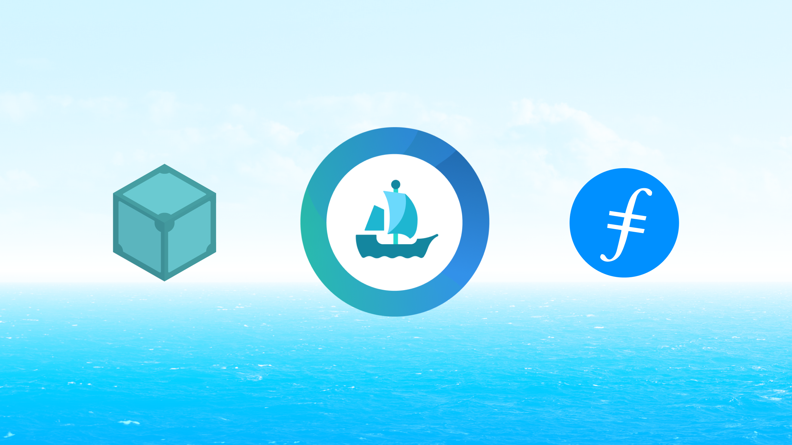

Here’s what’s happening in the [**InterPlanetary File System**](https://ipfs.io/) galaxy!

## OpenSea stores NFTs with IPFS and Filecoin

Our friends at [**OpenSea**](https://opensea.io/) recently [**launched**](https://opensea.io/blog/announcements/decentralizing-nft-metadata-on-opensea/) a feature to “freeze” NFT metadata, enabling NFT creators to properly decentralize their NFTs using IPFS and Filecoin. OpenSea is one of the largest NFT marketplaces in the web3 space, creating a market for millions of NFTs today. Using IPFS and Filecoin, NFT creators that use OpenSea can now create immutable NFT metadata using IPFS [**content addressing**](https://blog.ipfs.io/2021-04-05-storing-nfts-on-ipfs/) and [**provable and decentralized storage with Filecoin**](https://blog.ipfs.io/2021-06-03-ipfs-filecoin-content-persistence/). [**Learn more!**](https://blog.ipfs.io/2021-06-17-opensea-ipfs-filecoin/)

## NFT Development User Experience

We're interested in better understanding the user experience of people interested in NFT development. We're identifying candidates to participate in a 30 minute long user testing session between June 21st and June 24th. Participants who are selected and successfully complete these sessions will receive an Amazon gift card valued at $100 USD as compensation for their time. You don't need any previous experience with NFTs to participate in this study. However, you will need a strong internet connection to participate in a video conference over Zoom and share your screen. If you're interested in participating, please take a few minutes to fill out [**this short survey**](https://airtable.com/shrhx9adti08gphmJ). *You must be 18 years old or over to participate.

## Brand new on IPFS

* Infura launched their premium IPFS private beta! [**Connect to IPFS now**](https://infura.io/product/ipfs).
* HackMoney with ETHGlobal runs now through July 9th & has $300k in prizes up for grabs. [**Start building today**](https://hackathon.money/)!
* There's a [**new feature**](https://thenewstack.io/interplanetary-file-system-could-pave-the-way-for-a-distributed-permanent-web/) on IPFS in 'The New Stack' on paving the way for a distributed permanent web!
* Missed the latest IPLD sync? You can watch the full video with updates on the [**IPFS YouTube channel**](https://www.youtube.com/watch?v=wyTSLn362vE).

## Around the ecosystem 🌏

ChainSafe launched their Gaming SDK, the first open-source library of its kind that supports multi-wallets, multi-marketplaces & multi-blockchains. [**Dive in**](https://medium.com/chainsafe-systems/announcing-chainsafe-gaming-an-sdk-to-bridge-your-gaming-engines-to-the-web-3-0-ecosystem-f33aa27c7a98).

Outlier Ventures launched Filecoin Base Camp to accelerate 40 exceptional startups who are leveraging Filecoin, IPFS & libp2p to build & drive adoption of projects in decentralized data protocols & applications. [**Learn how to apply.**](https://outlierventures.io/base-camp/filecoin-base-camp/)

Pinata makes it easy to add your OpenSea NFT collection to Squarespace websites. [**See for yourself.**](https://medium.com/pinata/host-your-opensea-nft-collection-on-squarespace-with-pinata-3cb16413aebf)

Last week CloudflareTV celebrated its first anniversary with a broadcast spanning everything from the keynotes of Cloudflare Connect, to a day-long virtual career fair, to their flagship game show Silicon Valley Squares. [**Learn where to watch.**](https://blog.cloudflare.com/cloudflare-tv-live-1-000-times-and-counting/)

Berty Alpha is now available for Apple users. [**Try it here**](https://berty.tech/newsletter/news-60/).

The next IPFS meetup is Friday, June 29 at 10am PT/5pm UTC. [**Register to join us for a series of lightning talks**](https://www.meetup.com/en-AU/San-Francisco-IPFS/events/cbjsgsyccjbdc/)!

## Want to help build the new internet?

[**Backend/API Engineer**](https://boards.greenhouse.io/textileio/jobs/4017981004): As a Backend/API Engineer, you will research, contribute to the product vision and help define the roadmap of multiple products. You will build and maintain features on the [**Textile Hub**](https://github.com/textileio/textile), and build new services and systems to integrate with blockchain networks including [**Threads**](https://github.com/textileio/go-threads), [**Buckets**](https://github.com/textileio/go-buckets), [**Hub**](https://github.com/textileio/textile), and [**Powergate**](https://github.com/textileio/powergate). This role is for someone with solid coding experience and the ability to lead new features. Textile, Remote.

[**Full Stack Engineer**](https://boards.greenhouse.io/textileio/jobs/4017984004): This role is for someone with solid coding experience who likes to experiment, design, and learn new things. We are looking to fill this position soon. We are looking for someone who can rapidly scope and build new web applications and work with APIs and backend services. Textile, Remote.

[**Senior Backend Engineer**](https://pinata.cloud/careers#2): Pinata is looking for a Backend Engineer knowledgeable in NodeJS to help build the future of our platform. As a dedicated Backend Engineer, you will work directly with our CTO and engineering team to build products and features that accelerate our traction. They need somebody that’s experienced with building NodeJS based APIs and working with relational databases. Experience with file storing technologies is a big plus for this position. Pinata, Remote.

[**DevOps**](https://pinata.cloud/careers#1): Pinata is looking for somebody with a background in dev-ops to ensure everything runs smoothly as we scale into the future. As the first dedicated DevOps engineer, you will play a key role in helping Pinata design and build a world-class dev ops pipeline. They need somebody who knows how to create systems that monitor their infrastructure and help deploy new updates in an automated fashion. Pinata, Remote.

[**Multiple Positions Open**](https://jobs.lever.co/protocol): Protocol Labs has updated their job board with openings across positions in Administration, Business Development, Business Operations, Communications, Community, Engineering, Finance, Legal, Talent, Product, Project Management, Research, & Security. Protocol Labs, Filecoin, IPFS. Remote.

[**Software Engineers**](https://jobs.lever.co/protocol): Seeking seasoned software engineers with specializations in cryptography and systems, distributed systems, and peer-to-peer networks to help shape the next generation of network protocols. Filecoin, IPFS, libp2p, Remote.

Get the IPFS Weekly in your inbox, each Tuesday. [**Sign up now.**](https://ipfs.us4.list-manage.com/subscribe?u=25473244c7d18b897f5a1ff6b&id=cad54b2230)