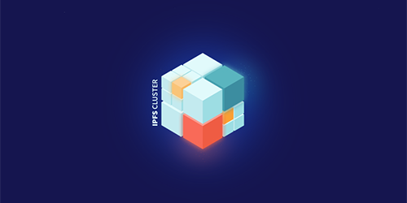

Here’s what’s happening in the [**InterPlanetary File System**](https://ipfs.io/) galaxy!

## Just released: IPFS Cluster 0.14.0!

We're happy to announce [**the release of IPFS Cluster 0.14.0**](https://blog.ipfs.io/2021-07-12-ipfs-cluster-0-14-0/)! IPFS Cluster provides an overlay layer to control and orchestrate pinsets in multiple IPFS daemons. It adds content, distributes pins, tracks them, and ensures content is replicated while providing streamlined API(s) for IPFS storage management. From feedback received, the [**release of IPFS Cluster 0.14.0**](https://blog.ipfs.io/2021-07-12-ipfs-cluster-0-14-0/) has added CAR import support, batched-pin ingestion, and automatic garbage collection to the Badger datastore, along with other optimizations, updates, and bug fixes.

## Browsers 3000 kicks off its 6 week event, including a presentation from ENS

@[youtube](dARxOaRd6Mc)

July 8th marked the beginning of Browsers 3000, a six-week event focused on integrating decentralized technologies into the browser experience for users around the world. So far, we’ve heard from team members of Unstoppable Domains, ENS, IPFS, Microsoft, Puma, Agregore, and more.

You can watch the full Browsers 3000 event so far [here](https://www.youtube.com/watch?v=dARxOaRd6Mc). To drill down to the role that ENS is playing in the evolution of the browser, [check out this learning session ](https://www.youtube.com/watch?v=_QW3RLLJ-oI&list=PLuhRWgmPaHtR2MDeMaiUcsBmBqpIBqFEP&index=1)from Makato Inoue, dev at [Ethereum Name Service](https://ens.domains/).

## Brand new on IPFS

* Short & sweet 一 demo from Mike Godsey about [**Infura’s new API beta**](https://www.youtube.com/watch?v=mLEkACKx_sc).
* [**Tooklkit for video streaming over IPFS**](https://github.com/SionoiS/dit), uses IPLD for linking stream data, all in Rust.
* Just announced - [**HackFS**](https://fs.ethglobal.co/), a virtual Hackathon by ETHGlobal & Protocol Labs, July 30th - August 20th.
* Read our [**overview**](https://blog.ipfs.io/2021-07-13-ceramic-mainnet-launch/) of the Ceramic Mainnet launch and its use of IPFS for decentralized storage.

## Around the ecosystem 🌏

Textile unveils plans to bring native Filecoin storage to NEAR, ETH, Polygon, and others - [**learn more**](https://blog.textile.io/native-filecoin-storage-for-blockchains/)!  
  
The Protocol Labs R&D teams have been working to bring zk-SNARKs to the world and to Filecoin. Today they launched a [**minisite**](https://research.protocol.ai/sites/snarks/) as the first preview into the vision & progress. [**Check it out**](https://filecoin.io/blog/posts/filecoin-zk-snarks-zero-knowledge-but-a-lot-of-zero-knowledge/).  
  
Just announced - Techstars and Protocol Labs are collaborating to launch the [**Filecoin Techstars Accelerator**](https://www.techstars.com/accelerators/filecoin) to focus on startups that use the IPFS and Filecoin Networks.  
  
[**The Graph just launched on Product Hunt**](https://www.producthunt.com/posts/the-graph)! The Graph lets anyone build APIs on top of decentralized networks like Ethereum and IPFS.  
  
Applications are open for Outlier Ventures’ Filecoin Base Camp accelerator. The 3-month remote accelerator gives teams access to stellar product support and up to $250,000 in funding per team. [**Learn more and apply.**](https://outlierventures.io/base-camp/filecoin-base-camp/)

## Upcoming Hackathons

There’s always more ways to build the IPFS ecosystem, check out these upcoming hackathons:

* [**IdentiHack by Hack Latin America**](https://hacklatam.com/identihack-2021) (June 28-August 16)
* [**NFT Vision Hack**](https://www.nftvisionhack.com/) (July - August)
* [**ETHOdyssey Hackathon**](https://ethodyssey.devfolio.co/) (July 2 - August 1)
* [**Browsers 3000**](https://events.protocol.ai/2021/browsers3000) (July 8-August 19)

## Want to help build the new internet?

[**Senior Software Engineer**](https://jobs.lever.co/protocol/3490e571-4d47-487e-a47f-b02f08668290): Distributed systems engineering lies at the center of many projects at Protocol Labs. With IPFS, libp2p, Filecoin, and other related projects, we are laying the foundation for a more resilient, more secure, distributed version of the web. This requires rigorous engineering from protocol design through all the phases of implementation. We strike a balance between pragmatism (put it on a ship :ferry:), deeply informed protocol design, and strict application of strong engineering principles. All of this happens in an environment defined by curiosity, passion, and a love for open source. **Protocol Labs**, Remote.

[**Fullstack Engineer**](https://boards.greenhouse.io/textileio/jobs/4017984004): Textile's web products and services are written primarily in Golang and TypeScript, and communicate with Textile's core gRPC services. You will own the end user experience and have full ownership over the product stack, from research and development to implementation and production monitoring. **Textile**, Remote.

[**Backend/API Engineer**](https://boards.greenhouse.io/textileio/jobs/4017981004): As a Backend/API Engineer, you will research, contribute to the product vision and help define the roadmap of multiple products. You will build and maintain features on the [**Textile Hub**](https://github.com/textileio/textile), and build new services and systems to integrate with blockchain networks including [**Threads**](https://github.com/textileio/go-threads), [**Buckets**](https://github.com/textileio/go-buckets), [**Hub**](https://github.com/textileio/textile), and [**Powergate**](https://github.com/textileio/powergate). This role is for someone with solid coding experience and the ability to lead new features. **Textile**, Remote.

[**Product Manager, Developer Experience**](https://jobs.lever.co/3box/68e3cf44-5ee8-4b2a-b872-bca815bf5caf): As a Product Manager on the Developer Experience team at 3Box Labs, you'll be in charge of delivering a best-in-class experience for developers building on the Ceramic platform. 3Box Labs created the leading identity and data solution for Web3, and alongside the open source developer community. They’re looking for impact-driven, intentional, and fast-learning teammates. **3Box Labs**, Remote.

[**Community Lead**](https://jobs.lever.co/3box/cac4d9b2-4822-4c91-99b8-16c5d3dd75b6): As a Community Lead at 3Box Labs, you’ll have the opportunity to create an incredibly engaged, welcoming, synergistic community around the technology and values that can help catalyze a global movement for a better web. 3Box Labs created the leading identity and data solution for Web3, and alongside the open source developer community. They’re looking for impact-driven, intentional, and fast-learning teammates. **3Box Labs**, Remote.

[**Protocol Engineer**](https://jobs.lever.co/3box/c766b0f1-d0e2-4c54-928d-c09152a94074): As a Protocol Engineer at 3Box Labs, you will contribute to the Ceramic protocol alongside the rest of the core engineers. Projects may include challenges with distributed consensus, sharding, access control systems, blockchain system design, and more. As an early team member, you'll have the opportunity to build deeper expertise in areas you're already familiar as well as explore those that are new. **3Box Labs**, Remote.

Get the IPFS Weekly in your inbox, each Tuesday. [**Sign up now.**](https://ipfs.us4.list-manage.com/subscribe?u=25473244c7d18b897f5a1ff6b&id=cad54b2230)