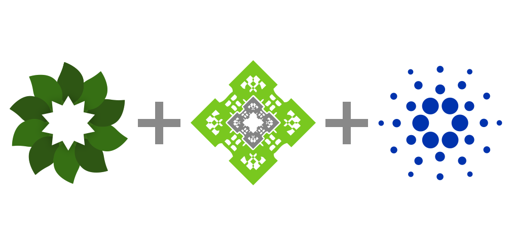

Here’s what’s happening in the [**InterPlanetary File System**](https://ipfs.io/) galaxy!

## Mint NFTs and Publish to IPFS From Wolfram

Jon Woodard, CEO of [Wolfram Blockchain Labs](https://blog.wolfram.com/2021/05/12/using-ipfs-filecoin-and-the-wolfram-language-to-build-a-unified-decentralized-services-interface/) (WBL), has worked to develop[ innovative smart contract solutions](https://www.wolframblockchainlabs.com/computational-facts/), including the opportunities for _collectible, credential,_ and _programmatic_ NFTs. During the five years Woodard and WBL have worked on NFTs, they have emerged as one of the largest sectors of consumer adoption for smart contracts. WBL has just announced the [Wolfram Language-Cardano](https://www.wolfram.com/language/) blockchain integration. The integration will make its debut with a liveminting event happening on July 27, 2021. During the liveminting event, an NFT will be created in real time on the Cardano blockchain for the audience, providing participants with a live look at innovation in progress. Learn more about the liveminting event: [“Stephen Wolfram’s Picks of Cellular Automata from the Computational Universe.”](https://blog.wolfram.com/2021/07/21/liveminting-nfts-with-the-wolfram-language-on-the-cardano-blockchain/)

## Introducing ChainSafe Storage (A Note from ChainSafe)

ChainSafe is proud to launch [**ChainSafe Storage**](https://storage.chainsafe.io/): Store files directly to the IPFS/Filecoin network. Storage is ChainSafe’s newest product which provides an intuitive front-end UI allowing devs to publicly pin and unpin files to IPFS, backed up to Filecoin. The service also exposes our APIs by providing API keys on demand, allowing anyone to build products connected to Filecoin and IPFS. We’re extremely excited to offer this product within the Filecoin and IPFS ecosystems. Our call to action for you: test it, build with it, explore with it. Discover the possibilities of building with Storage unlocks. To excite the imagination, here’s a reminder: our privacy-first, non-custodial file storage solution [**ChainSafe Files**](http://app.files.chainsafe.io/) was built using Storage. If you want to get in touch with our Files/Storage developers, don’t forget to drop into our Files #support channel on [**Discord**](https://discord.gg/CprJHjrWG6) to ask questions. For more updates, make sure to follow ChainSafe’s [**Twitter**](https://twitter.com/ChainSafeth)!

## Brand new on IPFS

* Check out this brand new [**“Introduction to libp2p”**](https://www.youtube.com/watch?v=7OZLImVRvro) talk with Software Engineer, Max Inden.
* go-ipfs v0.9.1 was released! This is a small bug fix release resolving the issues stated in the [**notes**](https://github.com/ipfs/go-ipfs/releases/tag/v0.9.1).
* The HackFS application deadline was extended! Interested in building the foundation for the decentralized web? [**Apply now!**](https://hack.ethglobal.co/hackfs2021)
* Yesterday at HackFS, IPFS Software Engineer, Ryan Baumann presented a workshop on “Browser Connectivity Walkthrough”. [**Watch!**](https://www.youtube.com/watch?v=xZiN9dLvMoU)

## Around the ecosystem 🌏

Libp2p has a roadmap - [**check it out**](https://github.com/libp2p/specs/blob/master/ROADMAP.md).  
  
Join Yusef Napora at HackFS 2021 for a workshop titled "#IPFS: Minting NFTs with IPFS and Friends" live at 8:30am ET. [**Tune in**](https://www.youtube.com/watch?v=XxoZGes7NWQ).  
  
The NFTVisionHack hackathon is ongoing through August 2nd and has a track for using IPFS and Filecoin + 68k in prizes! [**Start building today**](https://www.nftvisionhack.com/) before it’s too late.  
  
Browsers 3000 is in full swing with new learning sessions each week! [**Catch up in this Youtube playlist**](https://www.youtube.com/playlist?list=PLuhRWgmPaHtR2MDeMaiUcsBmBqpIBqFEP).  
  
Protocol Labs has announced their support of Element and the Matrix ecosystem! [**Read more**](https://element.io/blog/element-raises-30m-as-matrix-explodes/).   
  
As a part of the LongHashX Accelerator, LongHash Ventures is hosting an event, “Building your Web3 project with LongHashX” on July 29th at 9pm ET. [**Browse the agenda and register to attend**](https://docs.google.com/forms/d/e/1FAIpQLSc7AIMBQHIV_82EiM5DF98tDxtsheHAg0OeUniOed27SPXRBg/viewform).  
  
ETHGlobal’s HackMoney wrapped up earlier this month, bringing together 1100+ hackers, 231 projects, and 16 finalists from across the ecosystem. [**Read the hackathon recap**](https://ethglobalco.medium.com/hackmoney-2021-3-weeks-for-defi-94edb805d133).

## Upcoming Hackathons

There’s always more ways to build the IPFS ecosystem, check out these upcoming hackathons:

* [**IdentiHack by Hack Latin America**](https://hacklatam.com/identihack-2021) (June 28 - August 16)
* [**NFT Vision Hack**](https://www.nftvisionhack.com/) (July - August 30)
* [**ETHOdyssey Hackathon**](https://ethodyssey.devfolio.co/) (July 2 - August 1)
* [**Browsers 3000**](https://events.protocol.ai/2021/browsers3000) (July 8 - August 19)

## Want to help build the new internet?

[**Social Media Manager**](https://jobs.lever.co/protocol/c7b59dee-673b-42ff-85db-69e27a253f60): Protocol Labs is seeking a Social Media Manager to build best-practice growth strategies, own social tactics, and posting across all of our various channels. Your goal is to assist, educate, and excite every member of our community. You will be responsible for communication with our community primarily on Twitter, Reddit, and Slack but also occasionally over email, Telegram, Discord and other channels. This audience includes everyone from industry leaders, Protocol Labs partners, and investors to storage providers, developers, and users. **Protocol Labs**, Remote.

[**Senior Software Engineer**](https://jobs.lever.co/protocol/3490e571-4d47-487e-a47f-b02f08668290): Distributed systems engineering lies at the center of many projects at Protocol Labs. With IPFS, libp2p, Filecoin, and other related projects, we are laying the foundation for a more resilient, more secure, distributed version of the web. This requires rigorous engineering from protocol design through all the phases of implementation. We strike a balance between pragmatism (put it on a ship :ferry:), deeply informed protocol design, and strict application of strong engineering principles. All of this happens in an environment defined by curiosity, passion, and a love for open source. **Protocol Labs**, Remote.

[**Fullstack Engineer**](https://boards.greenhouse.io/textileio/jobs/4017984004): Textile's web products and services are written primarily in Golang and TypeScript, and communicate with Textile's core gRPC services. You will own the end user experience and have full ownership over the product stack, from research and development to implementation and production monitoring. **Textile**, Remote.

[**Backend/API Engineer**](https://boards.greenhouse.io/textileio/jobs/4017981004): As a Backend/API Engineer, you will research, contribute to the product vision and help define the roadmap of multiple products. You will build and maintain features on the [**Textile Hub**](https://github.com/textileio/textile), and build new services and systems to integrate with blockchain networks including [**Threads**](https://github.com/textileio/go-threads), [**Buckets**](https://github.com/textileio/go-buckets), [**Hub**](https://github.com/textileio/textile), and [**Powergate**](https://github.com/textileio/powergate). This role is for someone with solid coding experience and the ability to lead new features. **Textile**, Remote.

[**Product Manager, Developer Experience**](https://jobs.lever.co/3box/68e3cf44-5ee8-4b2a-b872-bca815bf5caf): As a Product Manager on the Developer Experience team at 3Box Labs, you'll be in charge of delivering a best-in-class experience for developers building on the Ceramic platform. 3Box Labs created the leading identity and data solution for Web3, and alongside the open source developer community. They’re looking for impact-driven, intentional, and fast-learning teammates. **3Box Labs**, Remote.

[**Community Lead**](https://jobs.lever.co/3box/cac4d9b2-4822-4c91-99b8-16c5d3dd75b6): As a Community Lead at 3Box Labs, you’ll have the opportunity to create an incredibly engaged, welcoming, synergistic community around the technology and values that can help catalyze a global movement for a better web. 3Box Labs created the leading identity and data solution for Web3, and alongside the open source developer community. They’re looking for impact-driven, intentional, and fast-learning teammates. **3Box Labs**, Remote.

[**Protocol Engineer**](https://jobs.lever.co/3box/c766b0f1-d0e2-4c54-928d-c09152a94074): As a Protocol Engineer at 3Box Labs, you will contribute to the Ceramic protocol alongside the rest of the core engineers. Projects may include challenges with distributed consensus, sharding, access control systems, blockchain system design, and more. As an early team member, you'll have the opportunity to build deeper expertise in areas you're already familiar as well as explore those that are new. **3Box Labs**, Remote.

Get the IPFS Weekly in your inbox, each Tuesday. [**Sign up now.**](https://ipfs.us4.list-manage.com/subscribe?u=25473244c7d18b897f5a1ff6b&id=cad54b2230)