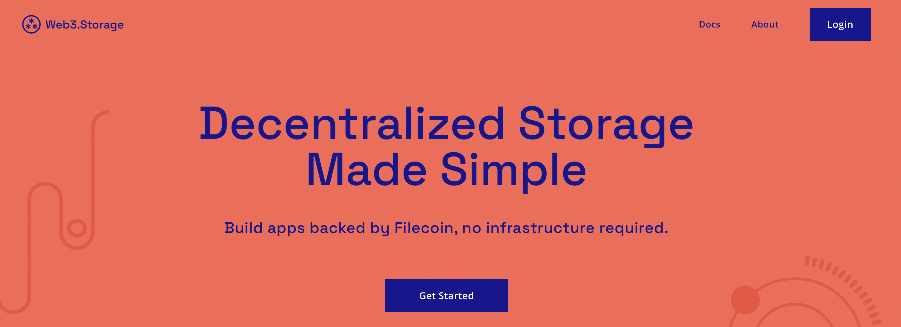

Here’s what’s happening in the [**InterPlanetary File System**](https://ipfs.io/) galaxy!

## Introducing Web3.Storage!

Protocol Labs has launched [**Web3.Storage**](https://web3.storage/), a simple interface for developers to store and retrieve data from Filecoin’s decentralized storage network. Web3.Storage 一 which will remain free indefinitely 一 gives developers an easy avenue to build applications with redundant, decentralized storage and secure, content addressed data. By handling a ton of the complexity of interacting directly with decentralized storage, it is the one of the best ways to integrate with Filecoin storage for all developers, from Web3 newbies to IPFS veterans! [**Try Web3.Storage now**](https://web3.storage/) plus learn how it works, how to interact with it, and what’s next in [**this blog post**](https://filecoin.io/blog/posts/introducing-web3-storage/).

## js-IPFS 0.56.0 Upgrade

[**js-IPFS 0.56.0**](https://github.com/ipfs/js-ipfs/releases/tag/ipfs%400.56.0) is on its way to the moon with a new data layer and import/export for [**Content Addressable aRchives**](https://ipld.io/specs/transport/car/) along with many small bug fixes and performance improvements! All part of the js-IPFS roadmap ([**check it out here**](https://github.com/orgs/ipfs/projects/6)). Read [**this blog post**](https://blog.ipfs.io/2021-07-29-js-ipfs-0-56/) to learn more about the [**0.56.0 upgrade**](https://blog.ipfs.io/2021-07-29-js-ipfs-0-56/), including new features, breaking changes, and bug fixes.

## Brand new on IPFS

* Inviting all hackers and gaming enthusiasts to [**JS13K**](https://js13kgames.com/decentralized) Hackathon brought to you by IPFS, Filecoin, and NEAR Protocol, starting August 13th!
* [**ChainSafe Files**](https://files.chainsafe.io/) sharing is live! Now share files without compromising security with encrypted sharing hosted on IPFS & backed to Filecoin.
* Alan Shaw joined NFT Vision Hack for an “IPFS & Filecoin Workshop” to discuss the IPFS/Filecoin track & the technology behind it. [**Watch here.**](https://www.youtube.com/watch?v=QPk2jiPQz8c&list=PLv_5UkIvD8CS3Y9-p7IqEw7dwNo3WpS6g&index=3)
* If you’re a developer or a web development shop with the know-how to publish a website to IPFS, join this [**referral list**](https://github.com/ipfs/community/discussions/630)!

## Around the ecosystem 🌏

A few weeks ago, Filecoin launched the [**SNARKs for the World**](https://research.protocol.ai/sites/snarks/) minisite. Read this [**deep dive**](https://filecoin.io/blog/posts/zero-knowledge-and-the-filecoin-network/) into what zero knowledge brings to the Filecoin network.  
  
ETHOdyssey wrapped yesterday, but there's still an opportunity to check out all of the hackathon [**submissions**](https://ethodyssey.devfolio.co/submissions).

  
[**HackFS**](https://hackfs.com/) started on Friday! 3 weeks of workshops, talks, and building with $175k+ in prizes, and there’s still room to attend.

  
Browsers 3000 is live through August 19th! So far we’ve seen learning sessions from MetaMask, Unlock, Agregore, ENS, Unstoppable Domains, and more. [**Register for the hackathon**](https://events.protocol.ai/2021/browsers3000/) and stay up to date with future sessions.

  
The 2021 Wanxiang Blockchain Hackathon starts today through September 12th, with a focus on integrating blockchain and other digital tech, such as 5G, AI and IoT. [**Register here to join IPFS and Filecoin at the event**](https://hackerlink.io/en/grant/Wanxiang/1).

## Want to help build the new internet?

[**Developer Relations**](https://boards.greenhouse.io/textileio/jobs/4075619004): Textile is seeking someone to run large-scale community projects. These include amplifying our grants program to fund community projects, curating governance groups where we bring community stakeholders into our technology planning, engaging with external teams like Gitcoin and EthDenver to support large-scale developer events, and giving technical presentations at events. This position also includes day-to-day engagement with our Slack group, helping to triage GitHub issues, hacking on demos, writing blog posts and technical guides, and more. We are looking for a self-directed leader who wants to build a developer community while staying hands on with technology. **Textile**, Remote.

[**Social Media Manager**](https://jobs.lever.co/protocol/c7b59dee-673b-42ff-85db-69e27a253f60): Protocol Labs is seeking a Social Media Manager to build best-practice growth strategies, own social tactics, and posting across all of our various channels. Your goal is to assist, educate, and excite every member of our community. You will be responsible for communication with our community primarily on Twitter, Reddit, and Slack but also occasionally over email, Telegram, Discord and other channels. This audience includes everyone from industry leaders, Protocol Labs partners, and investors to storage providers, developers, and users. **Protocol Labs**, Remote.

[**Senior Software Engineer**](https://jobs.lever.co/protocol/3490e571-4d47-487e-a47f-b02f08668290): Distributed systems engineering lies at the center of many projects at Protocol Labs. With IPFS, libp2p, Filecoin, and other related projects, we are laying the foundation for a more resilient, more secure, distributed version of the web. This requires rigorous engineering from protocol design through all the phases of implementation. We strike a balance between pragmatism (put it on a ship :ferry:), deeply informed protocol design, and strict application of strong engineering principles. All of this happens in an environment defined by curiosity, passion, and a love for open source. **Protocol Labs**, Remote.

[**Fullstack Engineer**](https://boards.greenhouse.io/textileio/jobs/4017984004): Textile's web products and services are written primarily in Golang and TypeScript, and communicate with Textile's core gRPC services. You will own the end user experience and have full ownership over the product stack, from research and development to implementation and production monitoring. **Textile**, Remote.

[**Backend/API Engineer**](https://boards.greenhouse.io/textileio/jobs/4017981004): As a Backend/API Engineer, you will research, contribute to the product vision and help define the roadmap of multiple products. You will build and maintain features on the [**Textile Hub**](https://github.com/textileio/textile), and build new services and systems to integrate with blockchain networks including [**Threads**](https://github.com/textileio/go-threads), [**Buckets**](https://github.com/textileio/go-buckets), [**Hub**](https://github.com/textileio/textile), and [**Powergate**](https://github.com/textileio/powergate). This role is for someone with solid coding experience and the ability to lead new features. **Textile**, Remote.

[**Product Manager, Developer Experience**](https://jobs.lever.co/3box/68e3cf44-5ee8-4b2a-b872-bca815bf5caf): As a Product Manager on the Developer Experience team at 3Box Labs, you'll be in charge of delivering a best-in-class experience for developers building on the Ceramic platform. 3Box Labs created the leading identity and data solution for Web3, and alongside the open source developer community. They’re looking for impact-driven, intentional, and fast-learning teammates. **3Box Labs**, Remote.

[**Community Lead**](https://jobs.lever.co/3box/cac4d9b2-4822-4c91-99b8-16c5d3dd75b6): As a Community Lead at 3Box Labs, you’ll have the opportunity to create an incredibly engaged, welcoming, synergistic community around the technology and values that can help catalyze a global movement for a better web. 3Box Labs created the leading identity and data solution for Web3, and alongside the open source developer community. They’re looking for impact-driven, intentional, and fast-learning teammates. **3Box Labs**, Remote.

[**Protocol Engineer**](https://jobs.lever.co/3box/c766b0f1-d0e2-4c54-928d-c09152a94074): As a Protocol Engineer at 3Box Labs, you will contribute to the Ceramic protocol alongside the rest of the core engineers. Projects may include challenges with distributed consensus, sharding, access control systems, blockchain system design, and more. As an early team member, you'll have the opportunity to build deeper expertise in areas you're already familiar as well as explore those that are new. **3Box Labs**, Remote.

Get the IPFS Weekly in your inbox, each Tuesday. [**Sign up now.**](https://ipfs.us4.list-manage.com/subscribe?u=25473244c7d18b897f5a1ff6b&id=cad54b2230)