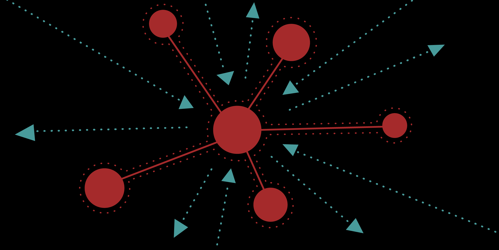
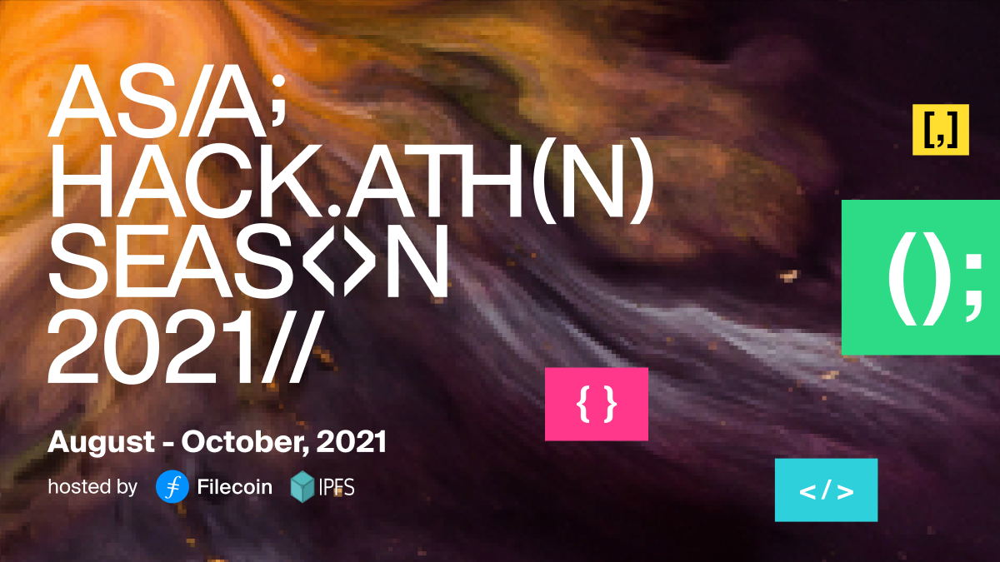

Here’s what’s happening in the [**InterPlanetary File System**](https://ipfs.io/) galaxy!

## Nebulus: the "Virtual IPFS Network"

In July, [**Nebulus**](https://nebulus.dev/), a “Virtual IPFS Network”, was released. Also dubbed the “IPFS-less IPFS” network, Nebulus allows users to use the logic and content addressability of IPFS without having to use the public network. Nebulus lets users work with IPFS files and storage locally before publishing to the public IPFS network (or, never publishing at all). Users can choose to use Nebulus as an “offline buffer”, allowing them to work privately with IPFS files and publish to IPFS only if/when needed. [**Learn more.**](https://blog.ipfs.io/2021-08-09-nebulus/)

## Wanxiang Blockchain Week & Asia Hackathon Season

The 2021 Wanxiang Blockchain Week has started and there is still time to join and build, focusing on integrating blockchain and other digital technologies, like 5G, AI, and IoT, to accelerate the digital transformation of various industries. [**Register here to join IPFS and Filecoin at the event!**](https://hackerlink.io/en/grant/Wanxiang/1)

  
Wanxiang Blockchain Week also marks the kick-off of the multi-event Asia Hackathon Season hosted by Filecoin and IPFS. The series will identify, accelerate, and highlight the incredible development work being done in Asia with the Filecoin and IPFS stacks. About $500,000 in prizes and grants will be available to teams, startups, projects, and entrepreneurs taking part. [**Register your email**](https://filecoin-community.typeform.com/to/scRusMWz) to stay in the loop about the upcoming events in the series!

## Brand new on IPFS

* The IPFS website now features an [**Ecosystem Directory**](https://ecosystem.ipfs.io/) allowing the community to explore the world of projects and products built on IPFS.
* Decrypt launched a new “Learn” tutorial featuring “How to use IPFS: the Backbone of Web3”! [**Read it**](https://decrypt.co/resources/how-to-use-ipfs-the-backbone-of-web3).
* [**IPFS & Filecoin Builder's Day Summit**](https://www.youtube.com/watch?v=tdqIvaZ28ns) was held on Friday, Aug 6th as part of the ongoing [**HackFS**](https://hackfs.com/) virtual hackathon with [**ETHGlobal**](https://ethglobal.co/) and Protocol Labs, watch the [**recording**](https://www.youtube.com/watch?v=tdqIvaZ28ns).
* Learn how to get started with NFT Project development in this [**new tutorial**](https://www.ejm.dev/nft-minting-quickstart-w-minty) “NFT Minting Quickstart with Minty” by community member, Evan James Martin.

## Around the ecosystem 🌏

So you’ve heard of the newly released [**ChainSafe Files**](https://files.chainsafe.io/), but you want to dive deeper? Read up with [**this article**](https://medium.com/chainsafe-systems/chainsafe-files-building-a-privacy-preserving-cloud-storage-bfa6d9eef3b2) that highlights Files’ architecture and why its users are top priority for ChainSafe.  
  
ICYMI - [**Web3.Storage**](https://web3.storage/) launched last week! Want to know how it works with IPFS? Check out [**this blog post**](https://filecoin.io/blog/posts/introducing-web3-storage/).   
  
Didn’t get a chance to apply to hack at [**HackFS**](https://hackfs.com/)? Don’t worry, there are still ten days left to join the fun - attend the summits [**here**](https://hackfs.com/).  
  
Last week, [**Chainlink**](http://chain.link/) and Filecoin launched a joint grant initiative to accelerate development of hybrid smart contracts that combine Chainlink decentralized oracles and Filecoin decentralized storage within a single application. [**Read all about it**](https://filecoin.io/blog/posts/announcing-chainlink-filecoin-joint-grants-for-dapps-combining-decentralized-storage-and-oracles/).  
  
The final Browsers3000 Learning Session is happening this Friday at 11am ET. [**Join**](https://protocol.zoom.us/meeting/register/tJwtdOiprjksE92l9qIVfgHKtUhhsgkuKau8) Michelle Lee for a presentation detailing the Protocol Labs Grants Program.  
  
Use NFTs in your game or app at [**NFT Vision Hack**](https://www.nftvisionhack.com/filecoin-and-ipfs) with NFT.Storage for a chance to win up to $10k USD in FIL. Submissions are due August 30th!

## Want to help build the new internet?

[**Developer Relations**](https://boards.greenhouse.io/textileio/jobs/4075619004): Textile is seeking someone to run large-scale community projects. These include amplifying our grants program to fund community projects, curating governance groups where we bring community stakeholders into our technology planning, engaging with external teams like Gitcoin and EthDenver to support large-scale developer events, and giving technical presentations at events. This position also includes day-to-day engagement with our Slack group, helping to triage GitHub issues, hacking on demos, writing blog posts and technical guides, and more. We are looking for a self-directed leader who wants to build a developer community while staying hands on with technology. **Textile**, Remote.

[**Social Media Manager**](https://jobs.lever.co/protocol/c7b59dee-673b-42ff-85db-69e27a253f60): Protocol Labs is seeking a Social Media Manager to build best-practice growth strategies, own social tactics, and posting across all of our various channels. Your goal is to assist, educate, and excite every member of our community. You will be responsible for communication with our community primarily on Twitter, Reddit, and Slack but also occasionally over email, Telegram, Discord and other channels. This audience includes everyone from industry leaders, Protocol Labs partners, and investors to storage providers, developers, and users. **Protocol Labs**, Remote.

[**Senior Software Engineer**](https://jobs.lever.co/protocol/3490e571-4d47-487e-a47f-b02f08668290): Distributed systems engineering lies at the center of many projects at Protocol Labs. With IPFS, libp2p, Filecoin, and other related projects, we are laying the foundation for a more resilient, more secure, distributed version of the web. This requires rigorous engineering from protocol design through all the phases of implementation. We strike a balance between pragmatism (put it on a ship :ferry:), deeply informed protocol design, and strict application of strong engineering principles. All of this happens in an environment defined by curiosity, passion, and a love for open source. **Protocol Labs**, Remote.

[**Fullstack Engineer**](https://boards.greenhouse.io/textileio/jobs/4017984004): Textile's web products and services are written primarily in Golang and TypeScript, and communicate with Textile's core gRPC services. You will own the end user experience and have full ownership over the product stack, from research and development to implementation and production monitoring. **Textile**, Remote.

[**Backend/API Engineer**](https://boards.greenhouse.io/textileio/jobs/4017981004): As a Backend/API Engineer, you will research, contribute to the product vision and help define the roadmap of multiple products. You will build and maintain features on the [**Textile Hub**](https://github.com/textileio/textile), and build new services and systems to integrate with blockchain networks including [**Threads**](https://github.com/textileio/go-threads), [**Buckets**](https://github.com/textileio/go-buckets), [**Hub**](https://github.com/textileio/textile), and [**Powergate**](https://github.com/textileio/powergate). This role is for someone with solid coding experience and the ability to lead new features. **Textile**, Remote.

[**Product Manager, Developer Experience**](https://jobs.lever.co/3box/68e3cf44-5ee8-4b2a-b872-bca815bf5caf): As a Product Manager on the Developer Experience team at 3Box Labs, you'll be in charge of delivering a best-in-class experience for developers building on the Ceramic platform. 3Box Labs created the leading identity and data solution for Web3, and alongside the open source developer community. They’re looking for impact-driven, intentional, and fast-learning teammates. **3Box Labs**, Remote.

[**Community Lead**](https://jobs.lever.co/3box/cac4d9b2-4822-4c91-99b8-16c5d3dd75b6): As a Community Lead at 3Box Labs, you’ll have the opportunity to create an incredibly engaged, welcoming, synergistic community around the technology and values that can help catalyze a global movement for a better web. 3Box Labs created the leading identity and data solution for Web3, and alongside the open source developer community. They’re looking for impact-driven, intentional, and fast-learning teammates. **3Box Labs**, Remote.

[**Protocol Engineer**](https://jobs.lever.co/3box/c766b0f1-d0e2-4c54-928d-c09152a94074): As a Protocol Engineer at 3Box Labs, you will contribute to the Ceramic protocol alongside the rest of the core engineers. Projects may include challenges with distributed consensus, sharding, access control systems, blockchain system design, and more. As an early team member, you'll have the opportunity to build deeper expertise in areas you're already familiar as well as explore those that are new. **3Box Labs**, Remote.

Get the IPFS Weekly in your inbox, each Tuesday. [**Sign up now.**](https://ipfs.us4.list-manage.com/subscribe?u=25473244c7d18b897f5a1ff6b&id=cad54b2230)