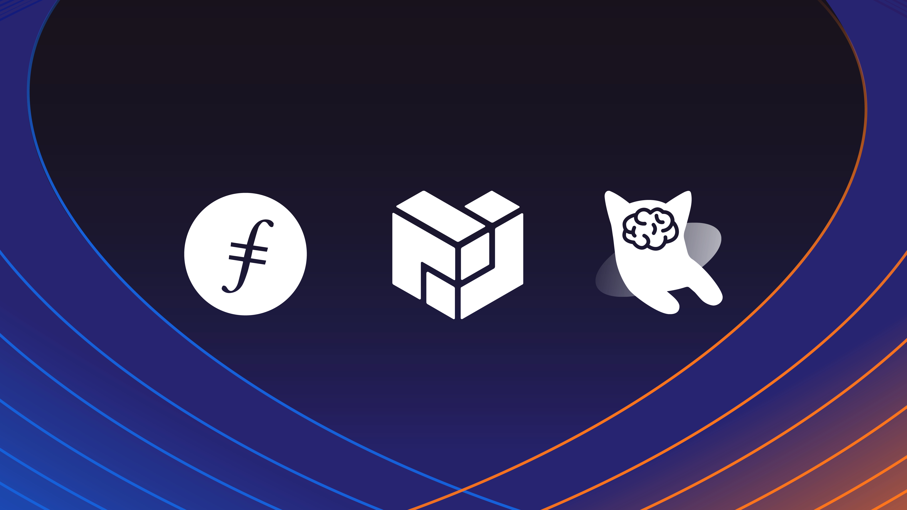

Here’s what’s happening in the [**InterPlanetary File System**](https://ipfs.io/) galaxy!

## DoraHacks

In July, the voting period ended for the 2021 DoraHacks Filecoin Grants Hackathon. Lasting over two months, Round 1 Grants distributed $249K to the winning projects building on IPFS and Filecoin among first, second, and third place. Some highlights from the winners:

* Box bridges the gap between the Web3 stack and mainstream JavaScript developers.
* Opscientia is a framework for hosting large neuroscience datasets on IPFS.
* Dweb Search is an open-source, decentralized search engine for IPFS and Filecoin.

And more! Check out profiles of [**all the winning projects**](https://filecoin.io/blog/posts/249k-for-17-projects-from-dorahacks-filecoin-grant-hackathon/).

## Browsers3000: IPFS Learning Session

@[youtube](YLK-4wwd6Sk)

Brand new from Browsers3000: an IPFS Learning Session with Dietrich Ayala! The session is an overview of the future of the internet, focusing on identifying the challenges in changing the web and the opportunity to add new capabilities. Web3, content addressing, and IPFS enable many of those capabilities. [**Dive in and learn more**](https://www.youtube.com/watch?v=YLK-4wwd6Sk).

And while you’re here, there are two more days of the Browsers3000 Hackathon, a six-week event gathering leaders in the future of the web browser. [**Register and tune in**](https://events.protocol.ai/2021/browsers3000/) for the last sessions.

## Brand new on IPFS

* JS-IPFS 0.57.0 is live with new [**bug fixes and features**](https://github.com/ipfs/js-ipfs/releases/tag/ipfs%400.57.0)!
* ICYMI: Watch Yusef Napora's workshop [**"Minting NFTs with IPFS and Friends"**](https://www.youtube.com/watch?v=XxoZGes7NWQ) from HackFS '21.
* [**Just announced**](https://www.coindesk.com/crypto-powered-audius-wins-tiktok-tie-up-for-streaming-music-direct-to-platform): TikTok chooses streaming service [**Audius**](https://audius.co/) as the solution behind its “Sounds” library. Audius and IPFS have a long history; check out the [**Building Web3 video series with Audius**](https://www.youtube.com/watch?v=c50licHTOik) and IPFS.
* It’s not quite new, but still worth talking about! Web3.storage is a simple interface for developers to store and retrieve data from Filecoin’s decentralized storage network. [**Learn more and get started.**](https://filecoin.io/blog/posts/introducing-web3-storage/)

## Around the ecosystem 🌏

Voting is open for the [**SXSW 2022 PanelPicker**](https://www.sxsw.com/news/2021/sxsw-panelpicker-community-voting/)! Check out and vote for these IPFS, Filecoin, and Protocol Labs talk pitches:

* [**Guardians of Our Shared History**](https://panelpicker.sxsw.com/vote/117184)
* [**IPFS and Filecoin for the Long Haul**](https://panelpicker.sxsw.com/vote/118750)
* [**Nft School: Create A Freshly Minted NFT Token**](https://panelpicker.sxsw.com/vote/118723)
* [**Building Tools for Clean Energy in Crypto**](https://panelpicker.sxsw.com/vote/118735)
* [**How the Future of Music NFTs Will Empower Creators**](https://panelpicker.sxsw.com/vote/118578)

[**Outlier Ventures’ Diffusion 2021**](https://diffusion.events/) took place on July 28th and 29th. Protocol Labs co-founder and CEO Juan Benet joined to give a presentation about ‘Building the Metaverse.’ [**Check out the presentation**](https://www.youtube.com/watch?v=n0PSd0MM4EE) and learn more about the Filecoin and IPFS components of the emerging Metaverse.

Three more days of [**HackFS**](https://hackfs.com/)! The hackathon ends on August 20th — but there’s still plenty of time to get involved and tune in for the presentations, sessions, workshops, and more. Check out the agenda and [**register here.**](https://hackfs.com/)

Last week, Alan Shaw joined the [**Filecoin Encode Club**](https://www.encode.club/filecoin-club) for an “Intro to IPFS.” Catch up with the [**recording**](https://www.youtube.com/watch?v=PW43J7KmRCA) if you’ve been wanting to learn IPFS basics.

The IPFS Meetup program is currently on a summer holiday but join us next month for the September meetup on the 28th. [**Register now**](https://www.meetup.com/San-Francisco-IPFS/events/cbjsgsyccmblc/)!

## Want to help build the new internet?

[**ARG Software Engineer**](https://arg.protocol.ai/job-software-engineer): The Protocol Labs [**Application Research Group (ARG)**](https://arg.protocol.ai/)is seeking a proactive and autonomous builder that can draft a roadmap forward and execute with code. You will need to have both a passion for hands-on development of distributed systems as well as problem solving within a complex system. **Protocol Labs**, Remote.

[**Developer Relations**](https://boards.greenhouse.io/textileio/jobs/4075619004): Textile is seeking someone to run large-scale community projects. These include amplifying our grants program to fund community projects, curating governance groups where we bring community stakeholders into our technology planning, engaging with external teams like Gitcoin and EthDenver to support large-scale developer events, and giving technical presentations at events. This position also includes day-to-day engagement with our Slack group, helping to triage GitHub issues, hacking on demos, writing blog posts and technical guides, and more. We are looking for a self-directed leader who wants to build a developer community while staying hands on with technology. **Textile**, Remote.

[**Social Media Manager**](https://jobs.lever.co/protocol/c7b59dee-673b-42ff-85db-69e27a253f60): Protocol Labs is seeking a Social Media Manager to build best-practice growth strategies, own social tactics, and posting across all of our various channels. Your goal is to assist, educate, and excite every member of our community. You will be responsible for communication with our community primarily on Twitter, Reddit, and Slack but also occasionally over email, Telegram, Discord and other channels. This audience includes everyone from industry leaders, Protocol Labs partners, and investors to storage providers, developers, and users. **Protocol Labs**, Remote.

[**Senior Software Engineer**](https://jobs.lever.co/protocol/3490e571-4d47-487e-a47f-b02f08668290): Distributed systems engineering lies at the center of many projects at Protocol Labs. With IPFS, libp2p, Filecoin, and other related projects, we are laying the foundation for a more resilient, more secure, distributed version of the web. This requires rigorous engineering from protocol design through all the phases of implementation. We strike a balance between pragmatism (put it on a ship :ferry:), deeply informed protocol design, and strict application of strong engineering principles. All of this happens in an environment defined by curiosity, passion, and a love for open source. **Protocol Labs**, Remote.

[**Fullstack Engineer**](https://boards.greenhouse.io/textileio/jobs/4017984004): Textile's web products and services are written primarily in Golang and TypeScript, and communicate with Textile's core gRPC services. You will own the end user experience and have full ownership over the product stack, from research and development to implementation and production monitoring. **Textile**, Remote.

[**Backend/API Engineer**](https://boards.greenhouse.io/textileio/jobs/4017981004): As a Backend/API Engineer, you will research, contribute to the product vision and help define the roadmap of multiple products. You will build and maintain features on the [**Textile Hub**](https://github.com/textileio/textile), and build new services and systems to integrate with blockchain networks including [**Threads**](https://github.com/textileio/go-threads), [**Buckets**](https://github.com/textileio/go-buckets), [**Hub**](https://github.com/textileio/textile), and [**Powergate**](https://github.com/textileio/powergate). This role is for someone with solid coding experience and the ability to lead new features. **Textile**, Remote.

[**Product Manager, Developer Experience**](https://jobs.lever.co/3box/68e3cf44-5ee8-4b2a-b872-bca815bf5caf): As a Product Manager on the Developer Experience team at 3Box Labs, you'll be in charge of delivering a best-in-class experience for developers building on the Ceramic platform. 3Box Labs created the leading identity and data solution for Web3, and alongside the open source developer community. They’re looking for impact-driven, intentional, and fast-learning teammates. **3Box Labs**, Remote.

[**Community Lead**](https://jobs.lever.co/3box/cac4d9b2-4822-4c91-99b8-16c5d3dd75b6): As a Community Lead at 3Box Labs, you’ll have the opportunity to create an incredibly engaged, welcoming, synergistic community around the technology and values that can help catalyze a global movement for a better web. 3Box Labs created the leading identity and data solution for Web3, and alongside the open source developer community. They’re looking for impact-driven, intentional, and fast-learning teammates. **3Box Labs**, Remote.

[**Protocol Engineer**](https://jobs.lever.co/3box/c766b0f1-d0e2-4c54-928d-c09152a94074): As a Protocol Engineer at 3Box Labs, you will contribute to the Ceramic protocol alongside the rest of the core engineers. Projects may include challenges with distributed consensus, sharding, access control systems, blockchain system design, and more. As an early team member, you'll have the opportunity to build deeper expertise in areas you're already familiar as well as explore those that are new. **3Box Labs**, Remote.

Get the IPFS Weekly in your inbox, each Tuesday. [**Sign up now.**](https://ipfs.us4.list-manage.com/subscribe?u=25473244c7d18b897f5a1ff6b&id=cad54b2230)