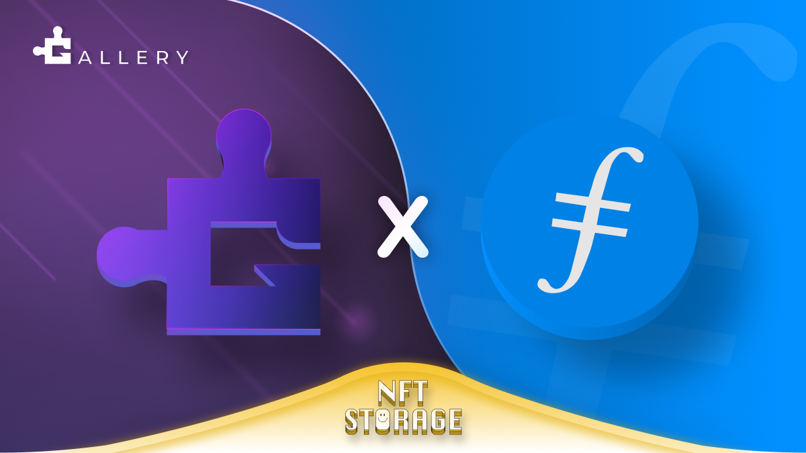

Here’s what’s happening in the [**InterPlanetary File System**](https://ipfs.io/) galaxy!

## JigStack Gallery Integrates IPFS and Filecoin

[**Gallery**](https://www.defigallery.co/) is the most recent solution from JigstackDAO, a governance platform for multiple DeFi products governed and incentivized by $STAK. Gallery is Jigstack’s entrance to the NFT ecosystem, developing novel and creative opportunities for NFTs and STAK holders. Gallery has just announced they will be using IPFS and Filecoin to store the NFTs that will be announced as part of their plans in the near future. [**Read more**](https://medium.com/jigstack/the-decentralized-storage-of-jigstack-gallerys-nfts-is-cemented-via-a-filecoin-collaboration-136dbd825cd2) and sign up to stay updated about Gallery’s release!

## Browsers3000 Ends with $38,000 in Rewards

@[youtube](TXX0mlNLKgs)

Last week, the [**Browsers3000 Hackathon**](https://events.protocol.ai/2021/browsers3000/) wrapped up, marking the end to the 6-week event celebrating and highlighting the companies around the world building the future of the web browsers. We heard from Brave, ENS, HNS, Agregore, IPFS, Filecoin, MetaMask, and many more. The hackathon ended with a total of 518 participants over the six weeks and $38,000 in prizes distributed among teams. And speaking of funding, don’t miss out on Michelle Lee’s Browsers3000 presentation highlighting all the opportunities to access grants for your IPFS and Filecoin projects. [**Check it out!**](https://www.youtube.com/watch?v=TXX0mlNLKgs&list=PLuhRWgmPaHtR2MDeMaiUcsBmBqpIBqFEP)

## Brand new on IPFS

* Straight out of HackFS, [**glide through this 4 min demo**](https://www.youtube.com/watch?v=TPREubF3XpY) of “CheckoutFS”. The app uses IPFS, Filecoin, Ceramic, and Ethereum to create a decentralized check out and purchase platform.
* Every other week, the Retrieval Market Builders get together to share progress in their projects in a demo format. Up this week? Myel + IPFS — [**check out the demos**](https://www.youtube.com/watch?v=uCtdFXA6uf4).
* Go-ipfs v0.10.0-rc1 is out and available from GitHub, dist.ipfs.io and via ipfs-update. Read the [**release issue**](https://github.com/ipfs/go-ipfs/issues/8176).
* Are you a team or individual interested in contract work for building IPFS, Filecoin or web3 apps generally? Add yourself [**here**](https://github.com/ipfs/community/discussions/630) so we can point clients your way!

## Around the ecosystem 🌏

Thursday, the 26th is the last day to vote in the panel picker process for SXSW 2022. Check out the [**thread of all the IPFS and Filecoin panels**](https://twitter.com/Filecoin/status/1425188726720933896) that have been proposed, and vote for your favorite to watch them next year.

Submissions for NFT Vision Hack end on August 30. The global online hackathon has been bringing together creatives, developers, and entrepreneurs to explore the fringes of what NFTs can do. Up to $68,000 in prizes — [**learn more**](https://www.nftvisionhack.com/).

Did you miss it? Last week, Filecoin and Polygon announced their collaboration to accelerate Web3 interoperability between the ecosystems. First on the docket, the recent launch of the Filecoin-Polygon bridge by the Textile team. [**Learn more**](https://filecoin.io/blog/posts/announcing-filecoin-polygon-bridge-and-free-storage-for-developers/) and say hello to Filecoin x Polygon.

OceanDAO’s Round 9 applications are ongoing! Ocean has $300,000 allocated for data-oriented projects. Apply until September 7 - [**learn more here**](https://twitter.com/oceanprotocol/status/1429828067401289736). (New to Ocean? Check out [**Decentralized Data Markets: Ocean + Filecoin**](https://www.youtube.com/watch?v=4Qa4dvpC5ow)).

## Want to help build the new internet?

[**Developer Relations Advocate**](https://unstoppabledomains.com/jobs/apply?job=4083034004): In this role, you will have an opportunity to shape the Unstoppable developer relations function. You’ll be managing the Unstoppable developer community, and engaging with the broader Web3 developer community in order to for us to have a seat at the proverbial table. Through technical content and programs, you will drive the growth of Unstoppable Domains’ brand as an unrivaled developer resource for building the future internet. Incorporating elements of education, development, and engagement, in this role you will wear many different hats in your effort to showcase the unique benefits of Unstoppable Domains in Web3. **Unstoppable Domains**, Remote.

[**ARG Software Engineer**](https://arg.protocol.ai/job-software-engineer): The Protocol Labs [**Application Research Group (ARG)**](https://arg.protocol.ai/)is seeking a proactive and autonomous builder that can draft a roadmap forward and execute with code. You will need to have both a passion for hands-on development of distributed systems as well as problem solving within a complex system. **Protocol Labs**, Remote.

[**Developer Relations**](https://boards.greenhouse.io/textileio/jobs/4075619004): Textile is seeking someone to run large-scale community projects. These include amplifying our grants program to fund community projects, curating governance groups where we bring community stakeholders into our technology planning, engaging with external teams like Gitcoin and EthDenver to support large-scale developer events, and giving technical presentations at events. This position also includes day-to-day engagement with our Slack group, helping to triage GitHub issues, hacking on demos, writing blog posts and technical guides, and more. We are looking for a self-directed leader who wants to build a developer community while staying hands on with technology. **Textile**, Remote.

[**Social Media Manager**](https://jobs.lever.co/protocol/c7b59dee-673b-42ff-85db-69e27a253f60): Protocol Labs is seeking a Social Media Manager to build best-practice growth strategies, own social tactics, and posting across all of our various channels. Your goal is to assist, educate, and excite every member of our community. You will be responsible for communication with our community primarily on Twitter, Reddit, and Slack but also occasionally over email, Telegram, Discord and other channels. This audience includes everyone from industry leaders, Protocol Labs partners, and investors to storage providers, developers, and users. **Protocol Labs**, Remote.

[**Senior Software Engineer**](https://jobs.lever.co/protocol/3490e571-4d47-487e-a47f-b02f08668290): Distributed systems engineering lies at the center of many projects at Protocol Labs. With IPFS, libp2p, Filecoin, and other related projects, we are laying the foundation for a more resilient, more secure, distributed version of the web. This requires rigorous engineering from protocol design through all the phases of implementation. We strike a balance between pragmatism (put it on a ship :ferry:), deeply informed protocol design, and strict application of strong engineering principles. All of this happens in an environment defined by curiosity, passion, and a love for open source. **Protocol Labs**, Remote.

[**Fullstack Engineer**](https://boards.greenhouse.io/textileio/jobs/4017984004): Textile's web products and services are written primarily in Golang and TypeScript, and communicate with Textile's core gRPC services. You will own the end user experience and have full ownership over the product stack, from research and development to implementation and production monitoring. **Textile**, Remote.

[**Backend/API Engineer**](https://boards.greenhouse.io/textileio/jobs/4017981004): As a Backend/API Engineer, you will research, contribute to the product vision and help define the roadmap of multiple products. You will build and maintain features on the [**Textile Hub**](https://github.com/textileio/textile), and build new services and systems to integrate with blockchain networks including [**Threads**](https://github.com/textileio/go-threads), [**Buckets**](https://github.com/textileio/go-buckets), [**Hub**](https://github.com/textileio/textile), and [**Powergate**](https://github.com/textileio/powergate). This role is for someone with solid coding experience and the ability to lead new features. **Textile**, Remote.

[**Product Manager, Developer Experience**](https://jobs.lever.co/3box/68e3cf44-5ee8-4b2a-b872-bca815bf5caf): As a Product Manager on the Developer Experience team at 3Box Labs, you'll be in charge of delivering a best-in-class experience for developers building on the Ceramic platform. 3Box Labs created the leading identity and data solution for Web3, and alongside the open source developer community. They’re looking for impact-driven, intentional, and fast-learning teammates. **3Box Labs**, Remote.

[**Community Lead**](https://jobs.lever.co/3box/cac4d9b2-4822-4c91-99b8-16c5d3dd75b6): As a Community Lead at 3Box Labs, you’ll have the opportunity to create an incredibly engaged, welcoming, synergistic community around the technology and values that can help catalyze a global movement for a better web. 3Box Labs created the leading identity and data solution for Web3, and alongside the open source developer community. They’re looking for impact-driven, intentional, and fast-learning teammates. **3Box Labs**, Remote.

[**Protocol Engineer**](https://jobs.lever.co/3box/c766b0f1-d0e2-4c54-928d-c09152a94074): As a Protocol Engineer at 3Box Labs, you will contribute to the Ceramic protocol alongside the rest of the core engineers. Projects may include challenges with distributed consensus, sharding, access control systems, blockchain system design, and more. As an early team member, you'll have the opportunity to build deeper expertise in areas you're already familiar as well as explore those that are new. **3Box Labs**, Remote.

Get the IPFS Weekly in your inbox, each Tuesday. [**Sign up now.**](https://ipfs.us4.list-manage.com/subscribe?u=25473244c7d18b897f5a1ff6b&id=cad54b2230)