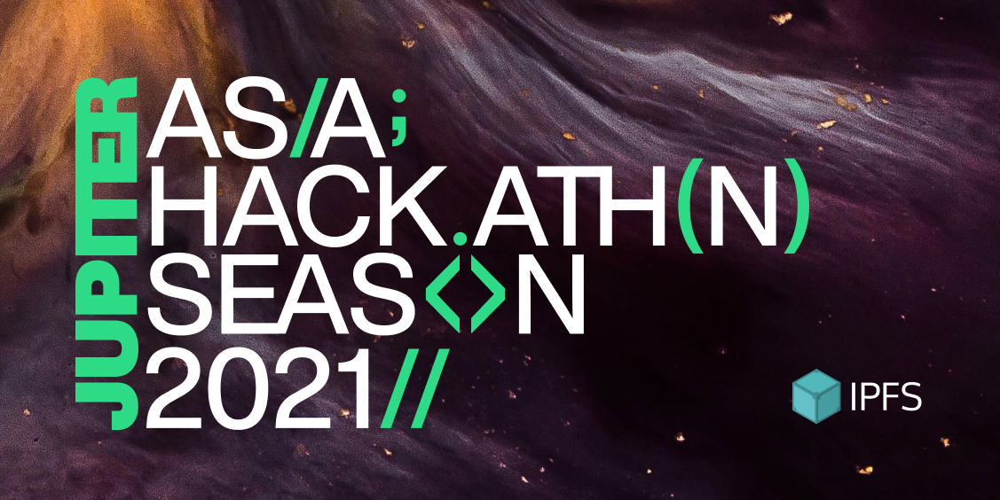

Here’s what’s happening in the [**InterPlanetary File System**](https://ipfs.io/) galaxy!

## **Announcing the Jupiter Hackathon**

Jupiter is a virtual hackathon lasting from late August to October focused on solutions building on IPFS or decentralized storage services that use IPFS. Technical support for Jupiter Hackathon is being provided by [Alibaba Cloud](https://us.alibabacloud.com/en), the digital technology and intelligence backbone of Alibaba Group.

[Applications will be accepted](https://tianchi.aliyun.com/competition/entrance/531928/introduction) now through September 30th. Judging will take place on October 14th and will be based on equally-weighted categories: Design, Novelty/Originality, Technical Complexity, Daily/Mass Usability, and Creativity/Fun.

  
On October 23rd, the Jupiter Hackathon will culminate in an offline demo day and reward ceremony in Shanghai, where $19,000 in prizes will be split among five winners for the best projects! Stay tuned for updates and details on future workshops. projects! Stay tuned for updates and details on future workshops. For more details, read this [post](https://blog.ipfs.io/announcing-jupiter-hackathon-alibaba-cloud/).

## Brand new on IPFS

* “How to Use IPFS” from Decrypt! [**Dive in.**](https://decrypt.co/resources/how-to-use-ipfs-the-backbone-of-web3)
* Scaffold-eth provides a new way to upload files to IPFS — [**check it out.**](https://twitter.com/austingriffith/status/1432431175675498496)
* "No Bigger Ship: IPFS and Strategies for Leverage in World-Scale Technology Adoption" with Berty Technologies and Dietrich Ayala. [**Listen here.**](https://www.youtube.com/watch?v=CTiTiNqe7x0)
* Recently, Textile launched the first Filecoin storage bridge on Polygon. It leverages the IPFS and Filecoin stacks to bring storage capabilities to the Polygon ecosystem. [**Learn more.**](https://blog.textile.io/filecoin-polygon-bridge-release/)

## Around the ecosystem 🌏

The one-year anniversary of Filecoin Mainnet is only a couple of months away. Already planning a celebration? Check out the new Filecoin grants program that will help cover costs for celebrations from Oct. 18-22. [**Apply**](https://github.com/filecoin-project/devgrants/blob/master/rfps/rfp-filecoin-orbit.md)!

On August 24th, Sameule from Fleek guest spoke at the eighth Encode Filecoin Club event, where he delivered an [**introduction to hosting on IPFS**](https://www.youtube.com/watch?v=B7hKnQigtKA) to students and hackers.

Check out [**MoNa Gallery**](https://www.mona.gallery/), a social gallery space for NFT artists, backed by the Tachyon Accelerator Launchpad II.

To celebrate the launch of Protocol Labs’ [**ConsensusLab**](https://research.protocol.ai/blog/2021/consensuslab-supercharging-our-consensus-research/) and establish a collaboration network, they are hosting [**ConsensusDay 21**](https://research.protocol.ai/sites/consensusday21/), a one-day virtual workshop on consensus research and related topics. [**Learn more and submit your contribution by September 8**](https://research.protocol.ai/sites/consensusday21/).

[**Browsers 3000 Hackathon**](https://browsers3000.devpost.com/) is wrapping up, with judging now underway of over 500 registrants and over 50 submissions for more than $40K in prizes. The final demo day is scheduled for September 16th. Stay tuned to learn about the winners and their projects.

Filecoin x Dapper Labs = the future of gaming and the metaverse. By leveraging Filecoin, Dapper Labs will establish and enact best practices for NFT.Storage, endowing the applications coming out of Labs with even more asset integrity.[**Learn more.**](https://filecoin.io/blog/posts/dapper-labs-integrates-filecoin/)

Crust network is a decentralized storage protocol that provides an incentive layer for IPFS storage network nodes. Through this [**overview video**](https://youtu.be/67fE9me0ZRU), learn the functional responsibilities of Crust and how users are stored in the network after placing an order.

## Want to help build the new internet?

[**Developer Relations Advocate**](https://unstoppabledomains.com/jobs/apply?job=4083034004): In this role, you will have an opportunity to shape the Unstoppable developer relations function. You’ll be managing the Unstoppable developer community, and engaging with the broader Web3 developer community in order to for us to have a seat at the proverbial table. Through technical content and programs, you will drive the growth of Unstoppable Domains’ brand as an unrivaled developer resource for building the future internet. Incorporating elements of education, development, and engagement, in this role you will wear many different hats in your effort to showcase the unique benefits of Unstoppable Domains in Web3. **Unstoppable Domains**, Remote.

[**ARG Software Engineer**](https://arg.protocol.ai/job-software-engineer): The Protocol Labs [**Application Research Group (ARG)**](https://arg.protocol.ai/)is seeking a proactive and autonomous builder that can draft a roadmap forward and execute with code. You will need to have both a passion for hands-on development of distributed systems as well as problem solving within a complex system. **Protocol Labs**, Remote.

[**Developer Relations**](https://boards.greenhouse.io/textileio/jobs/4075619004): Textile is seeking someone to run large-scale community projects. These include amplifying our grants program to fund community projects, curating governance groups where we bring community stakeholders into our technology planning, engaging with external teams like Gitcoin and EthDenver to support large-scale developer events, and giving technical presentations at events. This position also includes day-to-day engagement with our Slack group, helping to triage GitHub issues, hacking on demos, writing blog posts and technical guides, and more. We are looking for a self-directed leader who wants to build a developer community while staying hands on with technology. **Textile**, Remote.

[**Social Media Manager**](https://jobs.lever.co/protocol/c7b59dee-673b-42ff-85db-69e27a253f60): Protocol Labs is seeking a Social Media Manager to build best-practice growth strategies, own social tactics, and posting across all of our various channels. Your goal is to assist, educate, and excite every member of our community. You will be responsible for communication with our community primarily on Twitter, Reddit, and Slack but also occasionally over email, Telegram, Discord and other channels. This audience includes everyone from industry leaders, Protocol Labs partners, and investors to storage providers, developers, and users. **Protocol Labs**, Remote.

[**Senior Software Engineer**](https://jobs.lever.co/protocol/3490e571-4d47-487e-a47f-b02f08668290): Distributed systems engineering lies at the center of many projects at Protocol Labs. With IPFS, libp2p, Filecoin, and other related projects, we are laying the foundation for a more resilient, more secure, distributed version of the web. This requires rigorous engineering from protocol design through all the phases of implementation. We strike a balance between pragmatism (put it on a ship :ferry:), deeply informed protocol design, and strict application of strong engineering principles. All of this happens in an environment defined by curiosity, passion, and a love for open source. **Protocol Labs**, Remote.

[**Fullstack Engineer**](https://boards.greenhouse.io/textileio/jobs/4017984004): Textile's web products and services are written primarily in Golang and TypeScript, and communicate with Textile's core gRPC services. You will own the end user experience and have full ownership over the product stack, from research and development to implementation and production monitoring. **Textile**, Remote.

[**Backend/API Engineer**](https://boards.greenhouse.io/textileio/jobs/4017981004): As a Backend/API Engineer, you will research, contribute to the product vision and help define the roadmap of multiple products. You will build and maintain features on the [**Textile Hub**](https://github.com/textileio/textile), and build new services and systems to integrate with blockchain networks including [**Threads**](https://github.com/textileio/go-threads), [**Buckets**](https://github.com/textileio/go-buckets), [**Hub**](https://github.com/textileio/textile), and [**Powergate**](https://github.com/textileio/powergate). This role is for someone with solid coding experience and the ability to lead new features. **Textile**, Remote.

[**Product Manager, Developer Experience**](https://jobs.lever.co/3box/68e3cf44-5ee8-4b2a-b872-bca815bf5caf): As a Product Manager on the Developer Experience team at 3Box Labs, you'll be in charge of delivering a best-in-class experience for developers building on the Ceramic platform. 3Box Labs created the leading identity and data solution for Web3, and alongside the open source developer community. They’re looking for impact-driven, intentional, and fast-learning teammates. **3Box Labs**, Remote.

[**Community Lead**](https://jobs.lever.co/3box/cac4d9b2-4822-4c91-99b8-16c5d3dd75b6): As a Community Lead at 3Box Labs, you’ll have the opportunity to create an incredibly engaged, welcoming, synergistic community around the technology and values that can help catalyze a global movement for a better web. 3Box Labs created the leading identity and data solution for Web3, and alongside the open source developer community. They’re looking for impact-driven, intentional, and fast-learning teammates. **3Box Labs**, Remote.

Get the IPFS Weekly in your inbox, each Tuesday. [**Sign up now.**](https://ipfs.us4.list-manage.com/subscribe?u=25473244c7d18b897f5a1ff6b&id=cad54b2230)