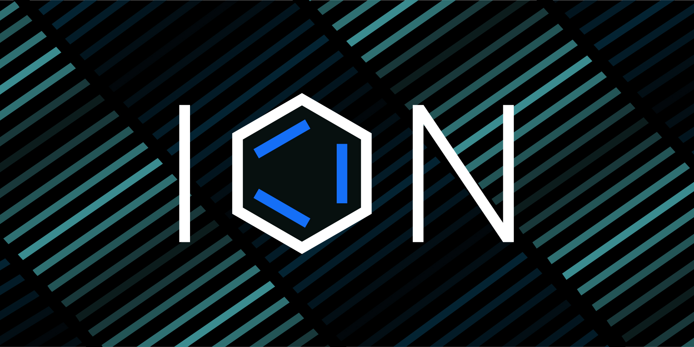

Here’s what’s happening in the [**InterPlanetary File System**](https://ipfs.io/) galaxy!

## ION is paving the way for a future with decentralized identities

How many people really know how their online identities work? In reality, online identity contains two types of data: identity data and identifiers. The way these two types of data have interacted over the course of the internet has defined our digital identities and how much control we have over them. ION is a solution being built as a framework for global, online, decentralized identities — leveraging fundamentals like DID and IFPS’ CID. Find out what the future of decentralized identities look like in [**this post**](https://blog.ipfs.io/ion-a-path-to-decentralized-identity/).

## Brand new on IPFS

* The Mars track of the Asia Hackathon Season is open for applications! Reinvent decentralized storage with Filecoin and IPFS and win up to $35,000 in prizes. [**Apply today**](https://xathon.mettl.com/event/MarsAsiaHackathon2021).
* Estuary? Web3.Storage? NFT.Storage? Maybe you’ve heard of them, but aren’t quite sure what they are and how they’re different. Check out this [**overview of the three decentralized storage solutions**](https://filecoin.io/blog/posts/decentralized-storage-estuary-web3.storage-and-nft.storage/)and their different uses.
* Join Michelle Lee of Protocol Labs as she gives a comprehensive “[**Introduction to IPFS and Filecoin**](https://www.youtube.com/watch?v=1xloqhD5C_8&list=PLXzKMXK2aHh63KtTQ0wUWbFOR7hL9RpKM&index=21)” from [**EthOnline**](https://online.ethglobal.com/) with [**EthGlobal**](https://ethglobal.com/).
* Having performance issues using the .eth.link gateway to resolve IPFS and ENS Domains sites? Try Eth.Limo! [**Learn more.**](https://blog.fleek.co/posts/eth-limo-alternative-eth-link)

## Around the ecosystem 🌏

Tatum collaborates with NFT.Storage to offer free IPFS storage for NFTs to developers. [**Read all about it**](https://blog.tatum.io/tatum-partners-with-nft-storage-to-offer-free-ipfs-storage-for-nfts-to-developers-183dad64e79d).   
  
A workshop focused on “Storing Data on the Filecoin Network with Textile” happened today, September 14th. [**Stay tuned**](https://medium.com/encode-club) for the recap and recording.  
  
[**EthOnline**](https://ethglobal.online/) is only just getting started. Tune in to the hackathon and join 1,000+ developers, builders, and engineers from across the ecosystem. Just in the first week, Protocol Labs, Polygon, Chainlink, Aave, 0x, and more have presented. Check out the full [**EthOnline 2021 schedule**](https://www.youtube.com/playlist?list=PLXzKMXK2aHh63KtTQ0wUWbFOR7hL9RpKM)!  
  
Event update! In order to accommodate community members who will be in attendance at Messari's MainNet conference, the Filecoin Launchpad Accelerator Demo Day has been rescheduled to September 28th from 11:00 am - 3:30 pm EDT. [**Register now**](https://mesh.xyz/tachyon/).  
  
“A Guide for How to build and host a .ETH website using IPFS on ENS.” Tune in with Mark Krynsky for an overview of how to point a .eth ENS name to a website using IPFS. [**Check it out.**](https://krynsky.com/a-guide-for-how-to-build-and-host-a-eth-website-using-ipfs-on-ens/)

## Want to help build the new internet?

[**ARG Software Engineer**](https://arg.protocol.ai/job-software-engineer): The Protocol Labs [**Application Research Group (ARG)**](https://arg.protocol.ai/)is seeking a proactive and autonomous builder that can draft a roadmap forward and execute with code. You will need to have both a passion for hands-on development of distributed systems as well as problem solving within a complex system. **Protocol Labs**, Remote.

[**Developer Relations**](https://boards.greenhouse.io/textileio/jobs/4075619004): Textile is seeking someone to run large-scale community projects. These include amplifying our grants program to fund community projects, curating governance groups where we bring community stakeholders into our technology planning, engaging with external teams like Gitcoin and EthDenver to support large-scale developer events, and giving technical presentations at events. This position also includes day-to-day engagement with our Slack group, helping to triage GitHub issues, hacking on demos, writing blog posts and technical guides, and more. We are looking for a self-directed leader who wants to build a developer community while staying hands on with technology. **Textile**, Remote.

[**Senior Software Engineer**](https://jobs.lever.co/protocol/3490e571-4d47-487e-a47f-b02f08668290): Distributed systems engineering lies at the center of many projects at Protocol Labs. With IPFS, libp2p, Filecoin, and other related projects, we are laying the foundation for a more resilient, more secure, distributed version of the web. This requires rigorous engineering from protocol design through all the phases of implementation. We strike a balance between pragmatism (put it on a ship :ferry:), deeply informed protocol design, and strict application of strong engineering principles. All of this happens in an environment defined by curiosity, passion, and a love for open source. **Protocol Labs**, Remote.

[**Fullstack Engineer**](https://boards.greenhouse.io/textileio/jobs/4017984004): Textile's web products and services are written primarily in Golang and TypeScript, and communicate with Textile's core gRPC services. You will own the end user experience and have full ownership over the product stack, from research and development to implementation and production monitoring. **Textile**, Remote.

[**Backend/API Engineer**](https://boards.greenhouse.io/textileio/jobs/4017981004): As a Backend/API Engineer, you will research, contribute to the product vision and help define the roadmap of multiple products. You will build and maintain features on the [**Textile Hub**](https://github.com/textileio/textile), and build new services and systems to integrate with blockchain networks including [**Threads**](https://github.com/textileio/go-threads), [**Buckets**](https://github.com/textileio/go-buckets), [**Hub**](https://github.com/textileio/textile), and [**Powergate**](https://github.com/textileio/powergate). This role is for someone with solid coding experience and the ability to lead new features. **Textile**, Remote.

[**Product Manager, Developer Experience**](https://jobs.lever.co/3box/68e3cf44-5ee8-4b2a-b872-bca815bf5caf): As a Product Manager on the Developer Experience team at 3Box Labs, you'll be in charge of delivering a best-in-class experience for developers building on the Ceramic platform. 3Box Labs created the leading identity and data solution for Web3, and alongside the open source developer community. They’re looking for impact-driven, intentional, and fast-learning teammates. **3Box Labs**, Remote.

[**Community Lead**](https://jobs.lever.co/3box/cac4d9b2-4822-4c91-99b8-16c5d3dd75b6): As a Community Lead at 3Box Labs, you’ll have the opportunity to create an incredibly engaged, welcoming, synergistic community around the technology and values that can help catalyze a global movement for a better web. 3Box Labs created the leading identity and data solution for Web3, and alongside the open source developer community. They’re looking for impact-driven, intentional, and fast-learning teammates. **3Box Labs**, Remote.

Get the IPFS Weekly in your inbox, each Tuesday. [**Sign up now.**](https://ipfs.us4.list-manage.com/subscribe?u=25473244c7d18b897f5a1ff6b&id=cad54b2230)