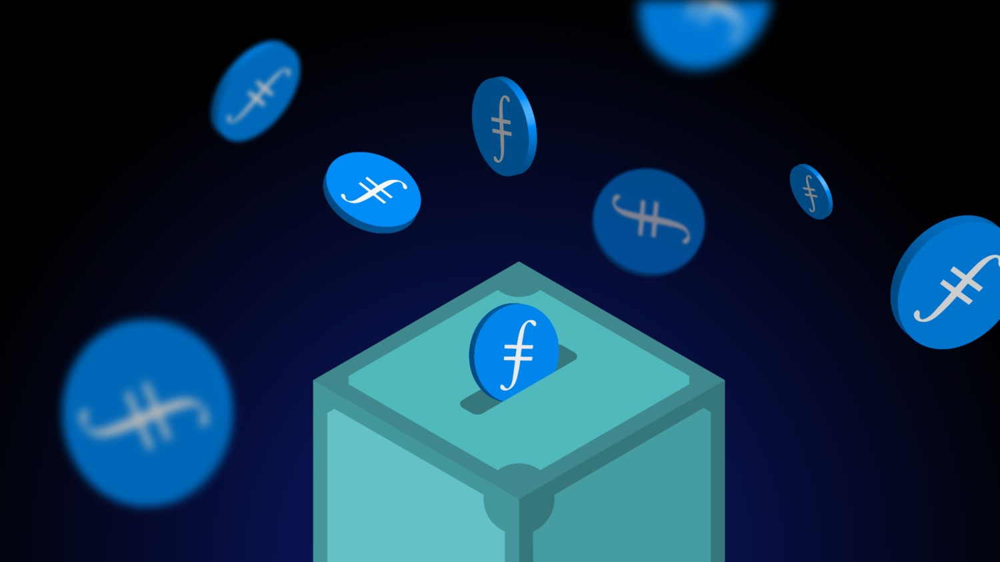

Here’s what’s happening in the [**InterPlanetary File System**](https://ipfs.io/) galaxy!

## **A New Paradigm for Web Storage**

IPFS and Filecoin are complementary systems, and the ecosystem has developed tools like [Textile](http://textile.io/) and [Estuary](http://estuary.tech/) to help them work together. With the increasing limitations for plugins, these tools are some of the best solutions for developing for web3 with current browsers. As time goes on and IPFS becomes more accessible, browsers will continue supporting native integration (see [Opera](https://blogs.opera.com/tips-and-tricks/2021/02/opera-crypto-files-for-keeps-ipfs-unstoppable-domains/) and [Brave](https://brave.com/ipfs-support/)). As these integrations continue, Textile and Estuary give a simple workaround for using the systems alongside one another. Check out the blog to [learn more about using Filecoin with IPFS](https://filecoin.io/blog/posts/using-filecoin-with-ipfs/).

## Brand new on IPFS

* Pan Chasinga, developer advocate for Filecoin and IPFS, presented at Mercury Hackathon last week on [“Building an NFT Pet Store with NFT.Storage & Flow”](https://www.youtube.com/watch?v=pr9RMKnj3pc) - watch now!
* Tune in to [Infura](https://infura.io/)’s monthly developer community meetup on Oct 5th at 11am ET to learn about transactions and connections to web3, featuring a presentation on “How to pave the way for a distributed, permanent web with IPFS”. [Save your spot!](https://www.crowdcast.io/e/infura-developer-community-call-Oct21)
* Looking to get started with Filecoin and IPFS? [Start here](https://protocollabs.notion.site/Getting-started-with-IPFS-Filecoin-173c73d4d8d64765a42058594bc46bb7) in this new ‘storefront’ for builders beginning their journey in the ecosystem.
* There are already over 700 registrations for the Mars Hackathon with IPFS, Filecoin, and [Polygon](https://polygon.technology/). Be sure to [submit your ideas](https://www.marshackathon2021.com/) before Oct. 3rd!

## Around the ecosystem 🌏

Believe it or not, it’s been a year since Filecoin mainnet launch, and there’s a lot planned to celebrate one year in orbit. Stay tuned for more details coming soon!

Check out this new [deep dive blog post](https://filecoin.io/blog/posts/chainsafe-files-building-privacy-preserving-cloud-storage/) on ChainSafe Files that outlines the most important parts of Files’ architecture and highlights ChainSafe’s commitment to giving users sovereignty over their data.

Inviting NFT and blockchain developers of all experience levels to [apply to collaborate with fellow hackers](https://chain.link/hackathon), learn from top developers, and compete for $300K+ in prizes at this fall’s [Chainlink Hackathon](https://chain.link/hackathon)!

[MoNA Gallery](https://www.mona.gallery/) has a brand new room by Marc-O-Matic that showcases four incredible creatures from their universe. [Check it out](https://www.mona.gallery/r/marc0matic)!

NFT Hack with the [Filecoin Encode Club](https://www.encode.club/filecoin-club) kicks off on October 5th! [Register for the hackathon](https://www.encode.club/filecoin-club/#form) and be sure to [join us](https://www.eventbrite.co.uk/e/nft-hack-launch-tickets-169331201181?aff=ebdsoporgprofile) at the NFT Hack Launch Event.

## Want to help build the new internet?

[**Fullstack Developer**](https://weworkremotely.com/remote-jobs/akasha-foundation-fullstack-developer): By combining blockchain technologies such as Ethereum and the Interplanetary File System (IPFS), AKASHA has the potential to change the way ideas, thoughts, and experiences are shared and stored on the Internet. As part of the remote team distributed across the globe, you will work with some of the brightest minds in the blockchain tech space on unique and challenging ideas. You will also be in direct contact with the development and user community at large, actively participating in open discussions and brainstorming sessions. **AKASHA Foundation**, Remote.

[**ARG Software Engineer**](https://arg.protocol.ai/job-software-engineer): The Protocol Labs [**Application Research Group (ARG)**](https://arg.protocol.ai/)is seeking a proactive and autonomous builder that can draft a roadmap forward and execute with code. You will need to have both a passion for hands-on development of distributed systems as well as problem solving within a complex system. **Protocol Labs**, Remote.

[**Developer Relations**](https://boards.greenhouse.io/textileio/jobs/4075619004): Textile is seeking someone to run large-scale community projects. These include amplifying our grants program to fund community projects, curating governance groups where we bring community stakeholders into our technology planning, engaging with external teams like Gitcoin and EthDenver to support large-scale developer events, and giving technical presentations at events. This position also includes day-to-day engagement with our Slack group, helping to triage GitHub issues, hacking on demos, writing blog posts and technical guides, and more. We are looking for a self-directed leader who wants to build a developer community while staying hands on with technology. **Textile**, Remote.

[**Senior Software Engineer**](https://jobs.lever.co/protocol/3490e571-4d47-487e-a47f-b02f08668290): Distributed systems engineering lies at the center of many projects at Protocol Labs. With IPFS, libp2p, Filecoin, and other related projects, we are laying the foundation for a more resilient, more secure, distributed version of the web. This requires rigorous engineering from protocol design through all the phases of implementation. We strike a balance between pragmatism (put it on a ship :ferry:), deeply informed protocol design, and strict application of strong engineering principles. All of this happens in an environment defined by curiosity, passion, and a love for open source. **Protocol Labs**, Remote.

[**Fullstack Engineer**](https://boards.greenhouse.io/textileio/jobs/4017984004): Textile's web products and services are written primarily in Golang and TypeScript, and communicate with Textile's core gRPC services. You will own the end user experience and have full ownership over the product stack, from research and development to implementation and production monitoring. **Textile**, Remote.

[**Backend/API Engineer**](https://boards.greenhouse.io/textileio/jobs/4017981004): As a Backend/API Engineer, you will research, contribute to the product vision and help define the roadmap of multiple products. You will build and maintain features on the [**Textile Hub**](https://github.com/textileio/textile), and build new services and systems to integrate with blockchain networks including [**Threads**](https://github.com/textileio/go-threads), [**Buckets**](https://github.com/textileio/go-buckets), [**Hub**](https://github.com/textileio/textile), and [**Powergate**](https://github.com/textileio/powergate). This role is for someone with solid coding experience and the ability to lead new features. **Textile**, Remote.

[**Product Manager, Developer Experience**](https://jobs.lever.co/3box/68e3cf44-5ee8-4b2a-b872-bca815bf5caf): As a Product Manager on the Developer Experience team at 3Box Labs, you'll be in charge of delivering a best-in-class experience for developers building on the Ceramic platform. 3Box Labs created the leading identity and data solution for Web3, and alongside the open source developer community. They’re looking for impact-driven, intentional, and fast-learning teammates. **3Box Labs**, Remote.

[**Community Lead**](https://jobs.lever.co/3box/cac4d9b2-4822-4c91-99b8-16c5d3dd75b6): As a Community Lead at 3Box Labs, you’ll have the opportunity to create an incredibly engaged, welcoming, synergistic community around the technology and values that can help catalyze a global movement for a better web. 3Box Labs created the leading identity and data solution for Web3, and alongside the open source developer community. They’re looking for impact-driven, intentional, and fast-learning teammates. **3Box Labs**, Remote.

Get the IPFS Weekly in your inbox, each Tuesday. [**Sign up now.**](https://ipfs.us4.list-manage.com/subscribe?u=25473244c7d18b897f5a1ff6b&id=cad54b2230)