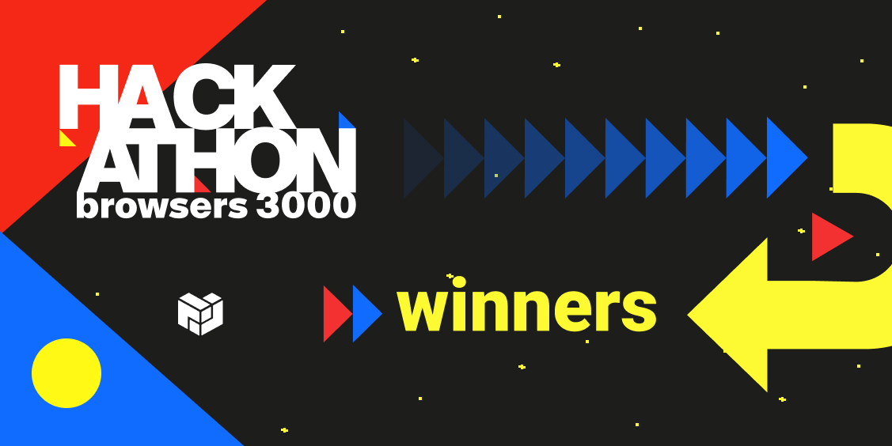

Here’s what’s happening in the [**InterPlanetary File System**](https://ipfs.io/) galaxy!

## **go-ipfs v0.10.0 Release**

Exciting news — [go-ipfs 0.10.0](https://github.com/ipfs/go-ipfs/releases/tag/v0.10.0) is live! This release brings some big changes to the IPLD internals of go-ipfs that make working with non-UnixFS DAGs easier than ever. There are also a variety of new commands and configuration options available.

As usual, this release includes important fixes, some of which may be critical for security. Unless the fix addresses a bug being exploited in the wild, the fix will _not_ be called out in the release notes. Please make sure to update ASAP. See the [release process](https://github.com/ipfs/go-ipfs/tree/master/docs/releases.md#security-fix-policy) for details and read the [release notes](https://github.com/ipfs/go-ipfs/releases/tag/v0.10.0) for the TLDR, highlights, changelog, and more.

## **Browsers 3000 Winners**

[Browsers 3000](https://events.protocol.ai/2021/browsers3000/) was a six-week hackathon that lasted from July to August. Over 30 projects building on Filecoin and IPFS joined the hackathon to iterate, test, and pitch their solutions to modernize “the browser” for the decentralized web3 world that is coming soon.

At the culmination of the event in September, three startups ([NetSepio](https://devpost.com/software/netsepio), [Blockforge](https://devpost.com/software/blockforge), and [IPFS WebGL Gaming](https://devpost.com/software/ipfs-webgl-gaming-platform)) were recipients of a total of $18,000 in prizes. You can [watch the full closing ceremony](https://www.youtube.com/watch?v=KL58k7dXj54&list=PLuhRWgmPaHtR2MDeMaiUcsBmBqpIBqFEP), including presentations of the winners and other amazing projects that participated in the hackathon. [Learn more about the winning projects](https://blog.ipfs.io/browsers-3000-hackathon-winners/) and their unique feature sets.

## **Brand new on IPFS**

* The winners of the IPFS and Filecoin tracks at [NFT Vision Hack](https://www.nftvisionhack.com/) were [announced at the closing award ceremony](https://www.youtube.com/watch?v=X0EaM1KWryM). Congratulations to Eclectica, CareCards, and J.O.S.H!
* The [ChainSafe Files](https://files.chainsafe.io/) team believe internet users should maintain full control over their data, which is why they [built a CLI tool for data retrieval from IPFS](https://medium.com/chainsafe-systems/true-data-ownership-your-keys-your-files-your-cids-dcfb0b2d50c) in case of front & back end failure.
* POAP is hosting an [NFT Treasure Hunt](http://poap.nyc/) in NYC on Oct. 31st to Nov. 4th, brought to you by Protocol Labs, [NFT.Storage](https://nft.storage/), and more! Stay tuned for more details.
* Last week [Michelle Lee](https://twitter.com/mishmosh) and [Dietrich Ayala](https://twitter.com/dietrich) of Protocol Labs joined Deploy Friday for an [episode dedicated to all things IPFS](https://www.youtube.com/watch?v=p5zNbs6HwrI) — watch now!

## Around the ecosystem 🌏

Just announced: [Filecoin Forum](https://www.filecoin.gallery/), hosted by [MoNa Gallery](https://www.mona.gallery/)! This event is an open call to all 3D artists, architects, and game developers to start building in web3 and be a part of a global community dedicated to building the metaverse with $200,000+ in prizes to be won. [Start building!](https://www.filecoin.gallery/)

Recently Protocol Labs announced a [limited-time referral fee program](https://filecoin.io/blog/posts/filecoin-project-gravity-a-sales-referral-program/) called Filecoin Project Gravity for community members who can bring large datasets onto the Filecoin network. Invite your customers, help create the data gravity pull, and earn a potential referral award!

Did you know that the largest ETHGlobal event of the year is happening right now? There are just ten days left of ETHOnline 2021 — [sign up for the summits now](https://online.ethglobal.com/)!

The program for [ConsensusDays 21](https://research.protocol.ai/sites/consensusday21/) is live! Check out what the [Protocol Labs Research](https://research.protocol.ai/) team has in store at the two days of consensus research, panels, and workshops. [Register and tune in this week](https://research.protocol.ai/sites/consensusday21/programme/) on October 6th and 7th.

## Want to help build the new internet?

[**Fullstack Developer**](https://weworkremotely.com/remote-jobs/akasha-foundation-fullstack-developer): By combining blockchain technologies such as Ethereum and the Interplanetary File System (IPFS), AKASHA has the potential to change the way ideas, thoughts, and experiences are shared and stored on the Internet. As part of the remote team distributed across the globe, you will work with some of the brightest minds in the blockchain tech space on unique and challenging ideas. You will also be in direct contact with the development and user community at large, actively participating in open discussions and brainstorming sessions. **AKASHA Foundation**, Remote.

[**ARG Software Engineer**](https://arg.protocol.ai/job-software-engineer): The Protocol Labs [**Application Research Group (ARG)**](https://arg.protocol.ai/)is seeking a proactive and autonomous builder that can draft a roadmap forward and execute with code. You will need to have both a passion for hands-on development of distributed systems as well as problem solving within a complex system. **Protocol Labs**, Remote.

[**Developer Relations**](https://boards.greenhouse.io/textileio/jobs/4075619004): Textile is seeking someone to run large-scale community projects. These include amplifying our grants program to fund community projects, curating governance groups where we bring community stakeholders into our technology planning, engaging with external teams like Gitcoin and EthDenver to support large-scale developer events, and giving technical presentations at events. This position also includes day-to-day engagement with our Slack group, helping to triage GitHub issues, hacking on demos, writing blog posts and technical guides, and more. We are looking for a self-directed leader who wants to build a developer community while staying hands on with technology. **Textile**, Remote.

[**Senior Software Engineer**](https://jobs.lever.co/protocol/3490e571-4d47-487e-a47f-b02f08668290): Distributed systems engineering lies at the center of many projects at Protocol Labs. With IPFS, libp2p, Filecoin, and other related projects, we are laying the foundation for a more resilient, more secure, distributed version of the web. This requires rigorous engineering from protocol design through all the phases of implementation. We strike a balance between pragmatism (put it on a ship :ferry:), deeply informed protocol design, and strict application of strong engineering principles. All of this happens in an environment defined by curiosity, passion, and a love for open source. **Protocol Labs**, Remote.

[**Fullstack Engineer**](https://boards.greenhouse.io/textileio/jobs/4017984004): Textile's web products and services are written primarily in Golang and TypeScript, and communicate with Textile's core gRPC services. You will own the end user experience and have full ownership over the product stack, from research and development to implementation and production monitoring. **Textile**, Remote.

[**Backend/API Engineer**](https://boards.greenhouse.io/textileio/jobs/4017981004): As a Backend/API Engineer, you will research, contribute to the product vision and help define the roadmap of multiple products. You will build and maintain features on the [**Textile Hub**](https://github.com/textileio/textile), and build new services and systems to integrate with blockchain networks including [**Threads**](https://github.com/textileio/go-threads), [**Buckets**](https://github.com/textileio/go-buckets), [**Hub**](https://github.com/textileio/textile), and [**Powergate**](https://github.com/textileio/powergate). This role is for someone with solid coding experience and the ability to lead new features. **Textile**, Remote.

[**Product Manager, Developer Experience**](https://jobs.lever.co/3box/68e3cf44-5ee8-4b2a-b872-bca815bf5caf): As a Product Manager on the Developer Experience team at 3Box Labs, you'll be in charge of delivering a best-in-class experience for developers building on the Ceramic platform. 3Box Labs created the leading identity and data solution for Web3, and alongside the open source developer community. They’re looking for impact-driven, intentional, and fast-learning teammates. **3Box Labs**, Remote.

[**Community Lead**](https://jobs.lever.co/3box/cac4d9b2-4822-4c91-99b8-16c5d3dd75b6): As a Community Lead at 3Box Labs, you’ll have the opportunity to create an incredibly engaged, welcoming, synergistic community around the technology and values that can help catalyze a global movement for a better web. 3Box Labs created the leading identity and data solution for Web3, and alongside the open source developer community. They’re looking for impact-driven, intentional, and fast-learning teammates. **3Box Labs**, Remote.

Get the IPFS Weekly in your inbox, each Tuesday. [**Sign up now.**](https://ipfs.us4.list-manage.com/subscribe?u=25473244c7d18b897f5a1ff6b&id=cad54b2230)