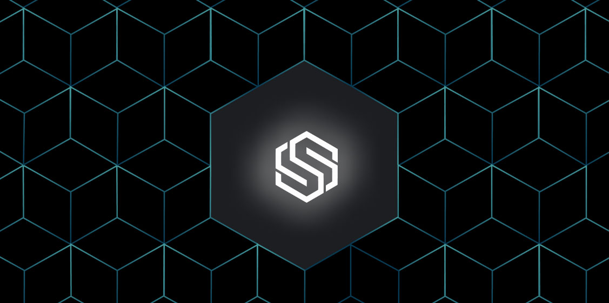

Here’s what’s happening in the [**InterPlanetary File System**](https://ipfs.io/) galaxy!

## Developing Consumer Decentralized Applications with Slate

Slate is an open-source version of file storage that allows users to upload their files to the Filecoin network, download other users' files, and ensure accessibility from anywhere on the web. It runs on Textile buckets to interact with IPFS so it can leverage content addressing and other features of that network. Thanks to Textile, Slate can offer 30GB of free storage to each user. But what can Slate be used for in consumer-based applications? [**Find out now!**](https://blog.ipfs.io/developing-consumer-decentralized-applications-with-textile-slate/)

## **Brand new on IPFS**

* One year ago, the Filecoin mainnet launched! From October 18 - 22, the Filecoin, IPFS, and Protocol Labs ecosystems are coming together to celebrate at Filecoin Orbit. [**Check out all of the events happening this week and register**](https://orbit.filecion.io/) to join in for talks, demos, workshops, and more.
* Molly Mackinlay of Protocol Labs was featured in Protocol.com’s [**Source Code Podcast**](https://www.protocol.com/tag/source-code-podcast) last week speaking about web3, web apps, content moderation, & building an internet that lasts. [**Read excerpts from the interview and hear the full podcast**](https://www.protocol.com/ipfs-new-internet).
* Last week, Encode Club hosted an [**Expert panel on IPFS and Filecoin**](https://www.youtube.com/watch?v=lm65mZAa984)for NFT Hack featuring David Choi, Mikeal Rogers, & Yusef Napora of Protocol Labs.
* Yusef Napora joined the Governance & DAOs Summit, part of ETHOnline '21 to present on "Simple Off Chain Data Storage Using Web3 Storage & NFT.Storage”, [**watch the full session.**](https://www.youtube.com/watch?v=EDtMXrx7UmE)

## Around the ecosystem 🌏

You can now [**connect decentralized Handshake domains to IPFS websites**](https://docs.ipfs.io/how-to/websites-on-ipfs/link-a-domain/#handshake)! Handshake shifts control of the root zone file away from ICANN to a decentralized blockchain. Handshake provides fully decentralized and uncensorable top-level domains that you can own and use for your websites. Namebase and Handshake offer users [**solutions to resolving web3 hostnames**](https://blog.ipfs.io/decentralizing-the-internet-s-root/).  
  
You often hear about the 10,000 NFT collection, but how does someone make thousands of unique images? Learn how to build an algorithmically generated image dataset in Python and host them on IPFS as a unique NFT with [**this tutorial**](https://dev.to/sydneylai/create-and-host-nfts-with-25-lines-of-code-4l4e) on dev.to written by Sydney Lai.  
  
Ipfs-coord has been released. This is a JavaScript npm library built on top of js-ipfs that provides high-level features such as subnets, peer discovery, E2EE, censorship resistance, and payments. It will help IPFS peers discover one another, coordinate around a common interest, and then stay connected around that interest. [**Find out more**](https://www.npmjs.com/package/ipfs-coord) and collaborate.  
  
Couldn’t make it to Prague for the Nonfungible Castle event sponsored by NFT.Storage? You can watch a recording of William R. Lobkowic’s [**tour of the NFC exhibition**](https://twitter.com/i/broadcasts/1MYxNnrdkabxw) on display at the Lobkowicz Palace in Prague Castle.  
  
[**Crust Network**](https://crust.network/), a decentralized IPFS-compatible storage network, has[**announced its deployment to Moonriver**](https://medium.com/crustnetwork/crust-network-integrates-with-moonriver-to-bring-web3-ipfs-storage-to-the-kusama-ecosystem-b73d934293bf), an Ethereum-compatible smart contract platform on Kusama. Crust underpins web3 data and file architecture, and brings IPFS-based decentralized storage solutions to the Moonriver and Kusama ecosystems.

## Want to help build the new internet?

[**Fullstack Developer**](https://weworkremotely.com/remote-jobs/akasha-foundation-fullstack-developer): By combining blockchain technologies such as Ethereum and the Interplanetary File System (IPFS), AKASHA has the potential to change the way ideas, thoughts, and experiences are shared and stored on the Internet. As part of the remote team distributed across the globe, you will work with some of the brightest minds in the blockchain tech space on unique and challenging ideas. You will also be in direct contact with the development and user community at large, actively participating in open discussions and brainstorming sessions. **AKASHA Foundation**, Remote.

[**ARG Software Engineer**](https://arg.protocol.ai/job-software-engineer): The Protocol Labs [**Application Research Group (ARG)**](https://arg.protocol.ai/)is seeking a proactive and autonomous builder that can draft a roadmap forward and execute with code. You will need to have both a passion for hands-on development of distributed systems as well as problem solving within a complex system. **Protocol Labs**, Remote.

[**Developer Relations**](https://boards.greenhouse.io/textileio/jobs/4075619004): Textile is seeking someone to run large-scale community projects. These include amplifying our grants program to fund community projects, curating governance groups where we bring community stakeholders into our technology planning, engaging with external teams like Gitcoin and EthDenver to support large-scale developer events, and giving technical presentations at events. This position also includes day-to-day engagement with our Slack group, helping to triage GitHub issues, hacking on demos, writing blog posts and technical guides, and more. We are looking for a self-directed leader who wants to build a developer community while staying hands on with technology. **Textile**, Remote.

[**Senior Software Engineer**](https://jobs.lever.co/protocol/3490e571-4d47-487e-a47f-b02f08668290): Distributed systems engineering lies at the center of many projects at Protocol Labs. With IPFS, libp2p, Filecoin, and other related projects, we are laying the foundation for a more resilient, more secure, distributed version of the web. This requires rigorous engineering from protocol design through all the phases of implementation. We strike a balance between pragmatism (put it on a ship :ferry:), deeply informed protocol design, and strict application of strong engineering principles. All of this happens in an environment defined by curiosity, passion, and a love for open source. **Protocol Labs**, Remote.

[**Fullstack Engineer**](https://boards.greenhouse.io/textileio/jobs/4017984004): Textile's web products and services are written primarily in Golang and TypeScript, and communicate with Textile's core gRPC services. You will own the end user experience and have full ownership over the product stack, from research and development to implementation and production monitoring. **Textile**, Remote.

[**Backend/API Engineer**](https://boards.greenhouse.io/textileio/jobs/4017981004): As a Backend/API Engineer, you will research, contribute to the product vision and help define the roadmap of multiple products. You will build and maintain features on the [**Textile Hub**](https://github.com/textileio/textile), and build new services and systems to integrate with blockchain networks including [**Threads**](https://github.com/textileio/go-threads), [**Buckets**](https://github.com/textileio/go-buckets), [**Hub**](https://github.com/textileio/textile), and [**Powergate**](https://github.com/textileio/powergate). This role is for someone with solid coding experience and the ability to lead new features. **Textile**, Remote.

[**Product Manager, Developer Experience**](https://jobs.lever.co/3box/68e3cf44-5ee8-4b2a-b872-bca815bf5caf): As a Product Manager on the Developer Experience team at 3Box Labs, you'll be in charge of delivering a best-in-class experience for developers building on the Ceramic platform. 3Box Labs created the leading identity and data solution for Web3, and alongside the open source developer community. They’re looking for impact-driven, intentional, and fast-learning teammates. **3Box Labs**, Remote.

[**Community Lead**](https://jobs.lever.co/3box/cac4d9b2-4822-4c91-99b8-16c5d3dd75b6): As a Community Lead at 3Box Labs, you’ll have the opportunity to create an incredibly engaged, welcoming, synergistic community around the technology and values that can help catalyze a global movement for a better web. 3Box Labs created the leading identity and data solution for Web3, and alongside the open source developer community. They’re looking for impact-driven, intentional, and fast-learning teammates. **3Box Labs**, Remote.

Get the IPFS Weekly in your inbox, each Tuesday. [**Sign up now.**](https://ipfs.us4.list-manage.com/subscribe?u=25473244c7d18b897f5a1ff6b&id=cad54b2230)