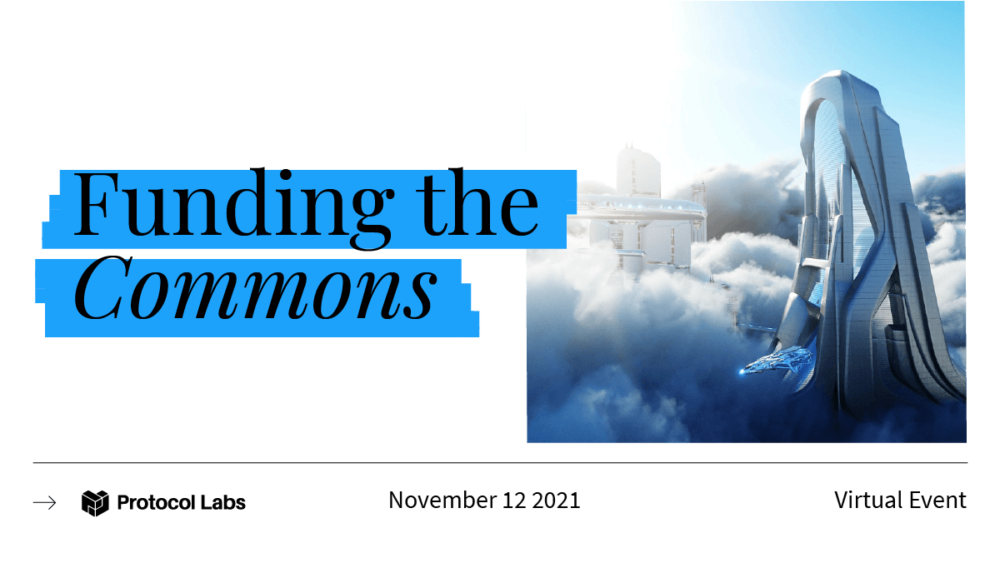

Here’s what’s happening in the [**InterPlanetary File System**](https://ipfs.io/) galaxy!

## Funding the Commons - November 12

[**Funding the Commons**](https://fundingthecommons.io/) is a virtual summit on November 12, 2021 for individuals and organizations building new models of sustainable public goods funding and value alignment in open source networks. Join Juan Benet of Protocol Labs, Vitalik Buterin of Ethereum, Karl Floersch of Optimism, and other thought leaders to discuss novel experiments and future directions for funding our collective commons. Full agenda coming soon.

## **The Three Fundamental Principles of IPFS**

Take a step back and reconnect with the fundamentals of IPFS — what powers the Interplanetary File System, and what it means for the future of decentralized storage and content addressing.

1. Unique identification via content addressing.
2. Content linking via Directed Acyclic Graphs (DAGs).
3. Content discovery via distributed hash tables (DHTs).

[**Check out the full post**](https://blog.ipfs.io/2021-11-03-understanding-fundamentals-of-ipfs/) from Charles Freeborn, including additional learning resources for IPFS.

## **Brand new on IPFS**

* As of last week, there are over 7 million NFTs stored via NFT.Storage and about 1 NFT being uploaded every second - and that’s just the beginning! Check out [**this twitter thread**](https://twitter.com/pooja_eth/status/1455969108428791809?s=21) for more.
* MetaMask now supports NFTs with IPFS-linked images! What does this mean? Your NFT images will persist 💪 [**Devs, get started.**](https://twitter.com/MetaMask/status/1455621048100171781)
* The Internet Archive was one of the first organizations to recognize the potential of IPFS to achieve the mission of storing humanity’s most valuable information. [**Listen to Internet Archive founder, Brewster Kahle**](https://www.youtube.com/watch?v=Ne_NyqYkQgo), on why he started the Archive.
* Just launched! [**Bittensor**](http://www.bittensor.com/) is building the largest decentralized text dataset on IPFS (codenamed: "the mountain") to enable decentralized artificial intelligence - [**learn more**](https://opentensor.gitbook.io/bittensor/understanding-bittensor/bittensor-dataset)!

## Around the ecosystem 🌏

Last month, 20 teams took part in a demo day hosted by the Filecoin Launchpad Accelerator, run by Tachyon. Check out [**this overview**](https://filecoin.io/blog/posts/filecoin-launchpad-accelerator-ii-defi/) of the DeFi projects that emerged from the accelerator and presented during Demo Day.   
  
Currently reside in Oceania and want to get involved in the Web3 ecosystem? Holon Innovate 2021 is the hackathon for you and today is the final day to apply - [**apply now**](https://taikai.network/en/holon/challenges/holon-innovate)!  
  
Eager to connect with the IPFS community? Every Thursday at 9am EST and 6pm EST, join the IPFS Gather ‘Office Hours’. Next one is November 11th! [**Gathertown link here.**](https://gather.town/invite?token=gRcV3RuETEHyqZGUb-st-CWwNMW60vLA)  
  
The Fall 2021 Chainlink Hackathon is live and running through November 28! Join NFT and blockchain developers of all experience levels to [**collaborate with fellow hackers**](https://chain.link/hackathon), learn from top developers, and compete for $550K+ in prizes.  
  
Still basking in the glow of Filecoin Orbit 2021? You can browse the entire playlist of talks [**here**](https://www.youtube.com/watch?v=Uya0C_lMSuY&list=PL_0VrY55uV1_HE_bE-frkYUPGybjYHbNz). Some highlights for IPFS: [**What’s Under the Textile Bridge?**](https://www.youtube.com/watch?v=i7YrrMBavDQ&list=PL_0VrY55uV1_HE_bE-frkYUPGybjYHbNz&index=7), [**The Future of NFTs: Opensea x Filecoin**](https://www.youtube.com/watch?v=4f_vzL2pPP8&list=PL_0VrY55uV1_HE_bE-frkYUPGybjYHbNz&index=9), [**IPLD and Wasm for Techies**](https://www.youtube.com/watch?v=GMlSGtHb-hU&list=PL_0VrY55uV1_HE_bE-frkYUPGybjYHbNz&index=36), [**Web3 Browsers are Ready for Decentralized Storage**](https://www.youtube.com/watch?v=1rMMEeZ6jI4&list=PL_0VrY55uV1_HE_bE-frkYUPGybjYHbNz&index=44), and more!  
  
The Babylon Project 2.0 Hackathon kicked off on October 29th. [**Join the IPFS and Filecoin tracks now**](https://worldblockchainhackathon.com/)!  
  
[**Textile bidbot**](https://github.com/textileio/bidbot) is storing 213TB+ of data on Filecoin and is used in Textile’s bridges between Filecoin and NEAR, Polygon, Ethereum, and others. Show some love and [**retweet the milestone**](https://twitter.com/pooja_eth/status/1455969125487058948).

## Want to help build the new internet?

[**Head of Content**](https://jobs.lever.co/protocol/330b0744-ebea-4bc3-90de-e817b470b8cb): Protocol Labs is seeking a Head of Content to develop and execute effective content deliverables for our portfolio and ecosystem projects including Filecoin and IPFS. The ideal candidate is an exceptional writer with a proven experience in communicating blockchain and Web3 concepts to developers, non-developers, enterprises, and newcomers. **Protocol Labs**, Remote.

[**Fullstack Performance Engineer**](https://angel.co/company/powerloom/jobs/1687602-fullstack-platform-engineer-1-fse-1-remote): At PowerLoom, they are building a decentralized protocol that creates a trusted audit trail of information that is independently verifiable, replayable and ready to extract higher order insights and analytics from. If you are passionate about coding on Python, solving complex data storage and fingerprinting puzzles, and have already worked on open source projects and/or production scale code, please apply. **PowerLoom**, Remote.

[**ARG Software Engineer**](https://arg.protocol.ai/job-software-engineer): The Protocol Labs [**Application Research Group (ARG)**](https://arg.protocol.ai/)is seeking a proactive and autonomous builder that can draft a roadmap forward and execute with code. You will need to have both a passion for hands-on development of distributed systems as well as problem solving within a complex system. **Protocol Labs**, Remote.

[**Developer Relations**](https://boards.greenhouse.io/textileio/jobs/4075619004): Textile is seeking someone to run large-scale community projects. These include amplifying our grants program to fund community projects, curating governance groups where we bring community stakeholders into our technology planning, engaging with external teams like Gitcoin and EthDenver to support large-scale developer events, and giving technical presentations at events. This position also includes day-to-day engagement with our Slack group, helping to triage GitHub issues, hacking on demos, writing blog posts and technical guides, and more. We are looking for a self-directed leader who wants to build a developer community while staying hands on with technology. **Textile**, Remote.

[**Senior Software Engineer**](https://jobs.lever.co/protocol/3490e571-4d47-487e-a47f-b02f08668290): Distributed systems engineering lies at the center of many projects at Protocol Labs. With IPFS, libp2p, Filecoin, and other related projects, we are laying the foundation for a more resilient, more secure, distributed version of the web. This requires rigorous engineering from protocol design through all the phases of implementation. We strike a balance between pragmatism (put it on a ship :ferry:), deeply informed protocol design, and strict application of strong engineering principles. All of this happens in an environment defined by curiosity, passion, and a love for open source. **Protocol Labs**, Remote.

[**Fullstack Engineer**](https://boards.greenhouse.io/textileio/jobs/4017984004): Textile's web products and services are written primarily in Golang and TypeScript, and communicate with Textile's core gRPC services. You will own the end user experience and have full ownership over the product stack, from research and development to implementation and production monitoring. **Textile**, Remote.

[**Backend/API Engineer**](https://boards.greenhouse.io/textileio/jobs/4017981004): As a Backend/API Engineer, you will research, contribute to the product vision and help define the roadmap of multiple products. You will build and maintain features on the [**Textile Hub**](https://github.com/textileio/textile), and build new services and systems to integrate with blockchain networks including [**Threads**](https://github.com/textileio/go-threads), [**Buckets**](https://github.com/textileio/go-buckets), [**Hub**](https://github.com/textileio/textile), and [**Powergate**](https://github.com/textileio/powergate). This role is for someone with solid coding experience and the ability to lead new features. **Textile**, Remote.

[**Product Manager, Developer Experience**](https://jobs.lever.co/3box/68e3cf44-5ee8-4b2a-b872-bca815bf5caf): As a Product Manager on the Developer Experience team at 3Box Labs, you'll be in charge of delivering a best-in-class experience for developers building on the Ceramic platform. 3Box Labs created the leading identity and data solution for Web3, and alongside the open source developer community. They’re looking for impact-driven, intentional, and fast-learning teammates. **3Box Labs**, Remote.

[**Community Lead**](https://jobs.lever.co/3box/cac4d9b2-4822-4c91-99b8-16c5d3dd75b6): As a Community Lead at 3Box Labs, you’ll have the opportunity to create an incredibly engaged, welcoming, synergistic community around the technology and values that can help catalyze a global movement for a better web. 3Box Labs created the leading identity and data solution for Web3, and alongside the open source developer community. They’re looking for impact-driven, intentional, and fast-learning teammates. **3Box Labs**, Remote.

Get the IPFS Weekly in your inbox, each Tuesday. [**Sign up now.**](https://ipfs.us4.list-manage.com/subscribe?u=25473244c7d18b897f5a1ff6b&id=cad54b2230)