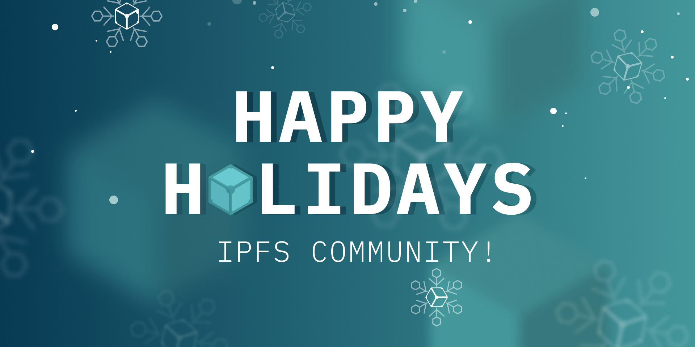

## **Project Showcase: OmniLingo**

There are many educational applications for learning a new language. There are none, however, that take advantage of Web3’s capability for open-source collaboration. [OmniLingo](https://omnilingo.xyz/) is using IPFS to enable language activists, language learners, and language instructors to form their own decentralized communities for under-represented languages. Find out more about how you can try the application and maybe learn a new language [here](https://blog.ipfs.io/2021-12-17-omnilingo/).

## **Brand New on IPFS**

1. [Take a look](https://medium.com/nttlabs/nerdctl-ipfs-975569520e3d) at how containerd is using IPFS to enable nerdctl’s experimental support for P2P container image distribution.
2. [Dive into](https://twitter.com/ProtoResearch/status/1471520384692404227?s=20) the discovery process of Content Identifiers on IPFS with a new visualization tool developed by Mobile Multimedia Lab.
3. Do you want to take your Filecoin and IPFS project to the next level? Last call for applications to the [Filecoin Techstars Accelerator](https://www.techstars.com/accelerators/filecoin)! Apply by tomorrow, Dec 22nd.
4. Find out how MODA DAO will [upload](https://www.globenewswire.com/news-release/2021/12/16/2353879/0/en/MODA-DAO-Partners-With-Filecoin-to-Bring-2000-Years-Worth-of-Music-Streaming-to-the-Blockchain.html) 2,000 years worth of music streaming to IPFS and Filecoin.

## **Around the Ecosystem**

Enjoy Jonathan Mann’s daily song release which featured a [catchy tune](https://twitter.com/songadaymann/status/1471221661760466959?s=20) explaining his appreciation for NFT.Storage!

The Filecoin Foundation and Protocol Labs have embarked on an experimental project to put New York City open data on the Filecoin Network! [Learn about the initiative](https://filecoinfoundation.medium.com/filecoin-foundation-and-protocol-labs-embark-on-experimental-project-to-put-new-york-city-open-data-99f6585c8630).

Don’t miss the Moralis Web3 development platform’s workshop on IPFS [streaming live](https://www.youtube.com/watch?v=ieV146r8FL0) on December 22nd at 10 am EST.

Be sure to check out Eat the Blocks’ [quick intro](https://www.youtube.com/watch?v=k1EQC7tdh70) to IPFS for Solidity developers.

Announcing the [Filecoin Accelerator by Encode Club](https://medium.com/encode-club/announcing-the-encode-filecoin-accelerator-c55f09264e8c), a 10-week online accelerator to receive support and mentorship plus a $5k stipend for participating. Apply by 01/04/22!

Check out Fredrik Rubensson’s [lecture](https://www.youtube.com/watch?v=l7I7XE0T9J8) on how to distribute the web with IPFS at Devoxx Poland. He goes into detail about file fingerprinting, version control, and identification as well as how nodes find relevant data and human-friendly addressing with IPNS.

## Want to help build the new internet?

[**Filecoin Green Program Administrator**](https://jobs.lever.co/protocol/33a795a3-a69e-4f89-82d7-3da0bd5626ce): We are searching for a Program Administrator who will help to track, manage and direct a team developing tomorrow’s environmental accounting tools. [**Filecoin Green**](https://medium.com/@filecoingreen) is a fast-growing initiative dedicated to measuring, reducing and mitigating environmental impacts within the Filecoin ecosystem and beyond. The team aims to catalyze this by enabling teams across the Filecoin ecosystem to verifiably report their emissions, and to use these data as the basis for impact reductions. **Protocol Labs**, Remote.

[**Community Manager**](https://valist.io/roles/community-manager.pdf): Valist is hiring a community manager to help expand outreach, community, and brand awareness. In this role, you will have a strong influence on our growth strategies, forge and develop great relationships with our community members and key partners, and create high quality content. You will be working closely with technical co-founders and engineers. **Valist**, Remote.

[**Head of Content**](https://jobs.lever.co/protocol/330b0744-ebea-4bc3-90de-e817b470b8cb): Protocol Labs is seeking a Head of Content to develop and execute effective content deliverables for our portfolio and ecosystem projects including Filecoin and IPFS. The ideal candidate is an exceptional writer with a proven experience in communicating blockchain and Web3 concepts to developers, non-developers, enterprises, and newcomers. **Protocol Labs**, Remote.

[**Developer Relations**](https://boards.greenhouse.io/textileio/jobs/4075619004): Textile is seeking someone to run large-scale community projects. These include amplifying our grants program to fund community projects, curating governance groups where we bring community stakeholders into our technology planning, engaging with external teams like Gitcoin and EthDenver to support large-scale developer events, and giving technical presentations at events. This position also includes day-to-day engagement with our Slack group, helping to triage GitHub issues, hacking on demos, writing blog posts and technical guides, and more. We are looking for a self-directed leader who wants to build a developer community while staying hands on with technology. **Textile**, Remote.

[**Senior Software Engineer**](https://jobs.lever.co/protocol/3490e571-4d47-487e-a47f-b02f08668290): Distributed systems engineering lies at the center of many projects at Protocol Labs. With IPFS, libp2p, Filecoin, and other related projects, we are laying the foundation for a more resilient, more secure, distributed version of the web. This requires rigorous engineering from protocol design through all the phases of implementation. We strike a balance between pragmatism, deeply informed protocol design, and strict application of strong engineering principles. All of this happens in an environment defined by curiosity, passion, and a love for open source. **Protocol Labs**, Remote.

[**Fullstack Engineer**](https://boards.greenhouse.io/textileio/jobs/4017984004): Textile's web products and services are written primarily in Golang and TypeScript, and communicate with Textile's core gRPC services. You will own the end user experience and have full ownership over the product stack, from research and development to implementation and production monitoring. **Textile**, Remote.

[**Backend/API Engineer**](https://boards.greenhouse.io/textileio/jobs/4017981004): As a Backend/API Engineer, you will research, contribute to the product vision and help define the roadmap of multiple products. You will build and maintain features on the [**Textile Hub**](https://github.com/textileio/textile), and build new services and systems to integrate with blockchain networks including [**Threads**](https://github.com/textileio/go-threads), [**Buckets**](https://github.com/textileio/go-buckets), [**Hub**](https://github.com/textileio/textile), and [**Powergate**](https://github.com/textileio/powergate). This role is for someone with solid coding experience and the ability to lead new features. **Textile**, Remote.