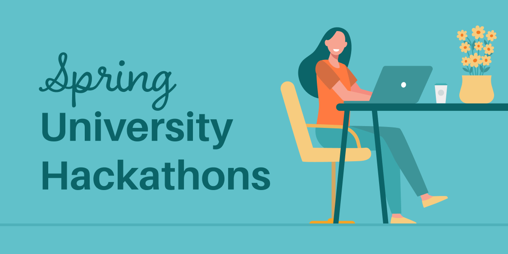

[**星际文件系统**](https://ipfs.io/)宇宙中，有这些新鲜事!

## Spring University黑客松活动概览

上个月，IPFS项目与两所不同的大学携手共同赞助由学生领导和组织的黑客松活动，致力于从全球和地方层面引入开创性举措。

[**Cal Hacks**](https://helloworld.calhacks.io/)，一个由加州大学伯克利分校学生组成的非盈利组织，举行了一次旨在团结世界上创新者、创造者和艺术灵感者的“hello:world”全球黑客松活动。其目的是激励学生在“永续性、连接性、教育或社区和公民参与”中创建一个与众不同的世界。

同样，加州大学联合学生会（ASUC）也举办了[**CivHacks**](https://www.civhacks.com/)，这是一个年度黑客松活动，专注于为支持科技文化的社会公益提供舒适、参与性强而又富含创造性的环境，开放的类别包括健康、永续性、学生发展和公民教育。欲知更多本次活动成果和获奖者情况，[**请点击此处查看近期博文**](https://blog.ipfs.io/2021-05-18-spring-hackathons/)。

## 使用Estuary Node从Filecoin Network中存储和检索数据

@[youtube](3hbtHcn0Piw)

Estuary是一个连接IPFS ⇆ Filecoin的网络节点。与其他节点不同，Estuary确保存储和检索目标符合用户的存储期望。Estuary使用自动化来进行Filecoin存储交易，用Filecoin检索交易来恢复IPFS pins，并对可靠的矿工进行修复交易。其结果是，对链上数据有了更好的保证，也更能确保数据不会从互联网上消失。[**Jimmy Lee的DoraHack 演讲**](https://youtu.be/3hbtHcn0Piw?t=2460) 是对我们研究成果以及我们计划向社区发布的API和文档的早期预览。欲为社区讨论添砖加瓦，[**请点击此处观看**](https://github.com/filecoin-project/community/discussions/105).

## IPFS新内容

* js-IPFS 0.55.0极大地改进了类型定义，[**点击此处阅读全部内容**](https://blog.ipfs.io/2021-05-11-js-ipfs-0-55/)。
* 现在Opera桌面浏览器可以支持IPFS了！ [**点击此处试试看吧！**](https://www.opera.com/computer)
* 开发人员现在可以使用Chainlink来引用IPFS上的JSON文件，以减少发放代币的gas成本[**点击此处查看教程**](https://blog.chain.link/fetch-ipfs-api-data-token-distribution/)！
* 如今，利用Pinata新的专用网关功能，创建带有自定义域名的IPFS网关变得易如反掌。[*_点击此处阅读全文_](https://www.coywolf.news/webmaster/dedicated-ipfs-gateway-custom-domain/)。

## 生态系统大事件 🌏

ETHGlobal的Web3周末将于5月28日至30日举行，届时将有2.5万美元以上的奖金等待争夺！ [**点击此处注册**](https://web3.ethglobal.co/)

在最近一次的Clubhouse会议上，Rarible将Protocol Labs、Async.art、Fleek和Arweave 聚集在一起，就NFT元数据的未来展开了建设性的讨论，[**点击此处查看回顾**](https://rarible.medium.com/meet-metadata-guardians-trying-to-make-your-nft-collection-available-100-years-from-now-60a18baeed6c)。

祝贺Livepeer团队正式迁移[**点击此处转到Graph Protocol mainnet**](https://medium.com/livepeer-blog/livepeer-is-one-of-the-graph-protocols-first-ten-mainnet-migration-partners-90f1c5a23a24)。

Wolfram Blockchain Labs推出了与IPFS和Filecoin的[**最新集成**](https://filecoin.io/blog/posts/wolfram-blockchain-labs-expanding-storage-functionality-with-ipfs-filecoin-for-dapp-development/)，将允许开发者利用存储、p2p网络和其他协议来完善他们现有的应用程序，并建立新的且充满创意的dApps。

6月21日，IPFS将与ifip举办为期一天的互联网去中心化研讨会，会议内容包括VPN、p2p网络等。[**点击此处注册参加**](https://networking.ifip.org/2021/registration)

Cryptovoxels [**宣布**](https://twitter.com/cryptovoxels/status/1174521499002253312) 他们正在向内容可寻址的直达式URL转变，这是他们迈向去中心化存储的第一步。

Filecoin Plus Day活动中，项目架构师、Filecoin Plus用户、加密经济专家、矿工等发表了[**精彩的项目介绍**](https://www.youtube.com/watch?v=wP4Bk8lBNUc) 。

Cloudflare正在举办一个关于扩展安全和游戏性能的现场网络研讨会和对话[**点击此处注册**](https://t.co/CBkw2d8Vkp?amp=1)。

## 接下来即将有: 五月IPFS线上交流会

欢迎回到IPFS线上交流会！请在5月25日星期二美国东部时间下午1点、北京时间上午10点加入我们吧，我们很高兴向IPFS社区介绍如下嘉宾。期待你加入我们的会谈！

* [**Almonit**](https://almonit.eth.link/#/)的Muhammed Tanrıkulu将展示Alpress，一个自我管理的ENS+IPFS出版平台。
* [**ResNetLab**](https://research.protocol.ai/tutorials/resnetlab-on-tour/)的Yiannis Psarras将展示“ResNetLab on Tour”，并提供即将举行的DI2F研讨会的最新情况。
* [**Spruce Systems**](https://www.spruceid.com/)的Wayne Chang，将展示Spruce Systems如何通过创建新的身份基础设施来重新构想可信的互动关系。

## 想为新型互联网出一份力吗？

[**高级后端工程师**](https://pinata.cloud/careers#2)：Pinata正在招募一位精通NodeJS的后端工程师来帮助打造平台未来。作为专门的后台工程师，将直接与CTO和工程团队合作，建立可加速牵引力的产品和功能。他们需要在构建基于NodeJS的API和与数据库合作方面有经验的人，有文件存储技术的经验是这个职位的一大优势。**Pinata**，远程。

[**开发运维工程师**](https://pinata.cloud/careers#1)：Pinata正在招募具备开发运维背景的人来确保顺利稳健向未来扩展。作为第一个专门的开发运维工程师，将在帮助Pinata设计和建立一个世界级的dev ops管道中发挥关键作用。此岗位需要会创建可监测基础设施系统并帮助其以自动化方式部署更新的人。**Pinata**，远程。

[**后台/平台工程师**](https://jobs.lever.co/3box) 3Box Labs正在招募一名后台工程师，他将为我们和社区建立关键的基础设施组建并支持可靠的部署。**3Box Labs**，远程。

[**协议工程师**](https://jobs.lever.co/3box) 3Box Labs正在招募一名协议工程师，为Ceramic Protocol扩展安全、隐私、功能和性能。**3Box Labs**，远程。

[**更多职位**](https://jobs.lever.co/protocol)：Protocol Labs已更新其招聘信息，包括行政、业务发展、业务运营、通信、社区、工程、财务、法律、人才、产品、项目管理、研究和安全等职位。**Protocol Labs、 Filecoin、 IPFS**，远程。

[**软件工程师**](https://jobs.lever.co/protocol)：招募在密码学和系统、分布式系统和p2p网络方面有专长且经验丰富的软件工程师，以帮助塑造下一代的网络协议。**Filecoin, IPFS、lib2p2**，远程。

[**高级全栈工程师**](https://textile.breezy.hr/p/d59ca1308346-senior-full-stack-engineer)：我们希望招募一个具有扎实编码经验，喜欢实验、设计和学习新事物的工程师。这个职位需要尽快入职。同时，我们希望此工程师可以快速界定和建立新的网络应用程序，并与API和后端服务做好合作。**Textile**，远程。

敬请期待我们每周二发布的IPFS周报。 [**点击此处，马上注册。**](https://ipfs.us4.list-manage.com/subscribe?u=25473244c7d18b897f5a1ff6b&id=cad54b2230)